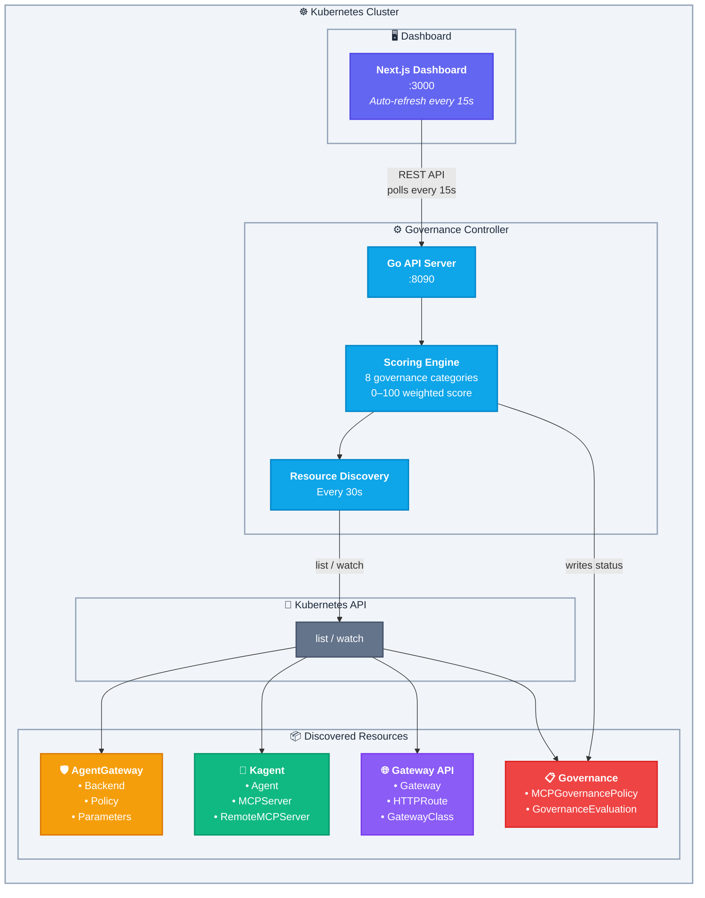

<p align="center">
  
</p>

<p align="center">
  <strong>Kubernetes-native governance for MCP (Model Context Protocol) infrastructure.</strong><br/>
  Monitors <a href="https://agentgateway.dev">AgentGateway</a> and <a href="https://kagent.dev">Kagent</a> resources, evaluates security posture with a policy-driven 0–100 scoring model, and surfaces findings in a real-time enterprise dashboard.
</p>

<p align="center">
  
  
  
  
  
  
</p>

---

## Table of Contents

- [Overview](#-overview)
- [Architecture](#-architecture)
- [What It Checks](#-what-it-checks)
- [Scoring Model](#-scoring-model)
- [Prerequisites](#-prerequisites)
- [Quick Start — Deploy to Kind](#-quick-start--deploy-to-kind)
- [Deploy to an Existing Cluster](#-deploy-to-an-existing-cluster)
- [Deploy with Helm](#-deploy-with-helm)
- [Configuration — MCPGovernancePolicy](#%EF%B8%8F-configuration--mcpgovernancepolicy)
- [Dashboard](#-dashboard)
- [API Reference](#-api-reference)
- [Local Development](#-local-development)
- [Testing](#-testing)
- [Project Structure](#-project-structure)
- [Custom Resources](#-custom-resources)
- [Makefile Reference](#-makefile-reference)
- [CI/CD & Releasing](#-cicd--releasing)
- [Troubleshooting](#-troubleshooting)
- [Contributing](#-contributing)
- [License](#-license)

---

## 🧭 Overview

As AI agents powered by the **Model Context Protocol (MCP)** proliferate across Kubernetes clusters, governance becomes critical. MCP servers expose tools to AI agents — but without proper controls, this creates security risks: unauthenticated endpoints, unencrypted connections, excessive tool exposure, and no audit trail.

**MCP Governance** solves this by:

1. **Discovering** all MCP-related resources in your cluster — AgentGateway backends, Kagent agents, RemoteMCPServers, Gateway API routes
2. **Evaluating** them against a configurable security policy defined as a Kubernetes CRD
3. **Scoring** your cluster's MCP security posture on a 0–100 scale across 8 governance categories
4. **Surfacing** findings, trends, and per-resource details in a real-time dashboard

---

## 🏗️ Architecture



### Data Flow

1. The **controller** discovers all MCP-related resources via the Kubernetes API every 30 seconds
2. It reads the **MCPGovernancePolicy** CRD to determine what to enforce
3. The **evaluator** scores the cluster and generates findings per category
4. Results are exposed via a REST API and written back to a **GovernanceEvaluation** CRD
5. The **dashboard** polls the API every 15 seconds and renders real-time visualizations

---

## 🔍 What It Checks

| Category | What's Evaluated | Default Severity |
|---|---|---|
| **AgentGateway Compliance** | All MCP traffic must route through AgentGateway proxy | Critical |
| **Authentication** | JWT authentication configured on gateway listeners | High |
| **Authorization** | CEL-based RBAC policies for MCP tool access | High |
| **CORS** | CORS policies attached to HTTP routes | Medium |
| **TLS** | TLS termination configured on gateways | High |
| **Prompt Guard** | Prompt injection protection on AI backends | Medium |
| **Rate Limiting** | Rate limit policies on MCP endpoints | Medium |
| **Tool Scope** | Per-server tool count vs configured thresholds | Warning / Critical |
| **Exposure** | Direct MCP server exposure without gateway — auto-escalates to Critical | Critical |

---

## 📊 Scoring Model

| Aspect | Details |
|---|---|
| **Scale** | 0–100 weighted score |
| **Grade** | **A** (90+) · **B** (70–89) · **C** (50–69) · **D** (30–49) · **F** (<30) |
| **Phase** | `Compliant` · `Warning` · `NonCompliant` · `Critical` |
| **Category weights** | Configurable — default: AgentGateway 25, Auth 20, AuthZ 15, CORS 10, TLS 10, PromptGuard 10, RateLimit 5, ToolScope 5 |
| **Severity penalties** | Configurable — default: Critical −40pts, High −25pts, Medium −15pts, Low −5pts |
| **Infrastructure absence** | If no MCP infrastructure exists for a required category → score = 0 (not a false 100) |

### How scoring works

Each category starts at 100. For every finding in that category, the corresponding severity penalty is subtracted (minimum 0). The final cluster score is a weighted average of all enabled category scores.

```
Category Score = max(0, 100 - Σ severity_penalty(finding))
Cluster Score  = Σ (category_score × weight) / Σ weights
```

---

## 📋 Prerequisites

| Tool | Version | Purpose |
|---|---|---|
| [Podman](https://podman.io/) or [Docker](https://docker.com/) | Any recent | Container image builds |
| [Kind](https://kind.sigs.k8s.io/) | v0.20+ | Local Kubernetes cluster |
| [kubectl](https://kubernetes.io/docs/tasks/tools/) | v1.28+ | Cluster management |
| [Helm](https://helm.sh/) | v3.12+ | Kubernetes package manager *(optional — for Helm-based deployment)* |
| [Go](https://go.dev/dl/) | 1.22+ | Controller development *(optional — only for local dev)* |
| [Node.js](https://nodejs.org/) | 20+ | Dashboard development *(optional — only for local dev)* |

---

## 🚀 Quick Start — Deploy to Kind

### One-command setup

```bash
# Clone the repo
git clone https://github.com/techwithhuz/mcp-security-governance.git
cd mcp-security-governance

# Create Kind cluster + build + deploy everything
make create-cluster
make all
make deploy-samples

# Open the dashboard
open http://localhost:3000
```

### Step-by-step breakdown

#### 1. Create the Kind cluster

```bash
make create-cluster
```

This creates a Kind cluster named `mcp-governance` with:
- Kubernetes v1.34.0
- Port mappings: `30000 → localhost:3000` (dashboard)
- Namespaces: `mcp-governance`, `mcp-system`, `agents`

#### 2. Build container images

```bash
make build-controller    # Builds Go controller image
make build-dashboard     # Builds Next.js dashboard image
```

#### 3. Load images into Kind

```bash
make load-images
```

> **Note:** If using Podman, you may need to manually save and load:
> ```bash
> podman save -o /tmp/controller.tar localhost/mcp-governance-controller:latest
> kind load image-archive /tmp/controller.tar --name mcp-governance
> ```

#### 4. Deploy

```bash
make deploy              # Applies CRDs + deploys controller & dashboard
make deploy-samples      # Applies the sample governance policy
```

#### 5. Verify

```bash
make status
```

Expected output:
```
📦 Deployments:
NAME                         READY   AGE
mcp-governance-controller    1/1     30s
mcp-governance-dashboard     1/1     30s

📋 Pods:
NAME                                          READY   STATUS    AGE
mcp-governance-controller-xxxxx-xxxxx         1/1     Running   30s
mcp-governance-dashboard-xxxxx-xxxxx          1/1     Running   30s

🔍 CRDs:
governanceevaluations.governance.mcp.io
mcpgovernancepolicies.governance.mcp.io
```

#### 6. Access

| Service | URL |
|---|---|
| Dashboard | http://localhost:3000 |
| API (via port-forward) | `kubectl port-forward -n mcp-governance svc/mcp-governance-controller 8090:8090` → http://localhost:8090 |

---

## 🏢 Deploy to an Existing Cluster

If you have a Kubernetes cluster with real MCP resources (AgentGateway, Kagent, etc.):

### 1. Build and push images

```bash
# Build
podman build -t your-registry/mcp-governance-controller:latest ./controller
podman build -t your-registry/mcp-governance-dashboard:latest ./dashboard

# Push
podman push your-registry/mcp-governance-controller:latest
podman push your-registry/mcp-governance-dashboard:latest
```

### 2. Update image references

Edit `deploy/k8s/deployment.yaml`:

```yaml
# Controller container
image: your-registry/mcp-governance-controller:latest
imagePullPolicy: Always    # Change from 'Never'

# Dashboard container
image: your-registry/mcp-governance-dashboard:latest
imagePullPolicy: Always    # Change from 'Never'
```

### 3. Deploy

```bash
kubectl create namespace mcp-governance
kubectl apply -f deploy/crds/governance-crds.yaml
kubectl apply -f deploy/k8s/deployment.yaml
kubectl apply -f deploy/samples/governance-policy.yaml
```

### 4. Expose the dashboard

```bash
# Port-forward (simplest)
kubectl port-forward -n mcp-governance svc/mcp-governance-dashboard 3000:3000

# Or change to LoadBalancer
kubectl patch svc mcp-governance-dashboard -n mcp-governance \
  -p '{"spec":{"type":"LoadBalancer"}}'
```

### RBAC

The controller requires read access to AgentGateway, Kagent, and Gateway API resources. All required `ClusterRole` and `ClusterRoleBinding` manifests are included in `deploy/k8s/deployment.yaml`. Review the permissions for your environment:

```yaml
# Resources the controller watches:
- agentgateway.dev: agentgatewaybackends, agentgatewayparameters, agentgatewaypolicies
- kagent.dev: agents, mcpservers, remotemcpservers
- gateway.networking.k8s.io: gateways, httproutes, gatewayclasses
- governance.mcp.io: mcpgovernancepolicies, governanceevaluations
- core: services, namespaces, pods
- apps: deployments
```

---

## 📦 Deploy with Helm

A Helm chart is provided in `charts/mcp-governance/` for streamlined installation and configuration.

### Prerequisites

| Tool | Version | Purpose |
|---|---|---|
| [Helm](https://helm.sh/) | v3.12+ | Kubernetes package manager |

### Install from local chart

```bash
# Clone the repo
git clone https://github.com/techwithhuz/mcp-security-governance.git
cd mcp-security-governance

# Install with default values (Kind / local development)
helm install mcp-governance ./charts/mcp-governance \
  --create-namespace

# Install with sample governance policy
helm install mcp-governance ./charts/mcp-governance \
  --create-namespace \
  --set samples.install=true
```

### Install for production (remote registry)

```bash
helm install mcp-governance ./charts/mcp-governance \
  --create-namespace \
  --set controller.image.repository=your-registry/mcp-governance-controller \
  --set controller.image.pullPolicy=Always \
  --set dashboard.image.repository=your-registry/mcp-governance-dashboard \
  --set dashboard.image.pullPolicy=Always \
  --set dashboard.service.type=ClusterIP \
  --set dashboard.service.nodePort=null \
  --set samples.install=true
```

### Install with custom values file

Create a `my-values.yaml`:

```yaml
controller:
  image:
    repository: your-registry/mcp-governance-controller
    tag: v1.0.0
    pullPolicy: Always

dashboard:
  image:
    repository: your-registry/mcp-governance-dashboard
    tag: v1.0.0
    pullPolicy: Always
  service:
    type: LoadBalancer
    nodePort: null

samples:
  install: true

governancePolicy:
  spec:
    requireAgentGateway: true
    requireJWTAuth: true
    requireRBAC: true
    requireCORS: true
    requireTLS: true
    requirePromptGuard: false
    requireRateLimit: false
    targetNamespaces:
      - production
      - staging
```

```bash
helm install mcp-governance ./charts/mcp-governance \
  --create-namespace \
  -f my-values.yaml
```

### Upgrade

```bash
helm upgrade mcp-governance ./charts/mcp-governance -f my-values.yaml
```

### Uninstall

```bash
helm uninstall mcp-governance
```

> **Note:** CRDs are annotated with `helm.sh/resource-policy: keep` and will **not** be deleted on uninstall to prevent data loss. To remove them manually:
> ```bash
> kubectl delete crd mcpgovernancepolicies.governance.mcp.io governanceevaluations.governance.mcp.io
> ```

### Helm Values Reference

| Parameter | Default | Description |
|---|---|---|
| `namespace` | `mcp-governance` | Namespace for all resources |
| `controller.replicas` | `1` | Controller replica count |
| `controller.image.repository` | `localhost/mcp-governance-controller` | Controller image |
| `controller.image.tag` | `latest` | Controller image tag |
| `controller.image.pullPolicy` | `Never` | Image pull policy |
| `controller.port` | `8090` | Controller API port |
| `controller.resources` | `50m/64Mi – 200m/128Mi` | CPU/memory requests and limits |
| `dashboard.enabled` | `true` | Deploy the dashboard |
| `dashboard.replicas` | `1` | Dashboard replica count |
| `dashboard.image.repository` | `localhost/mcp-governance-dashboard` | Dashboard image |
| `dashboard.image.tag` | `latest` | Dashboard image tag |
| `dashboard.image.pullPolicy` | `Never` | Image pull policy |
| `dashboard.port` | `3000` | Dashboard port |
| `dashboard.service.type` | `NodePort` | Service type (`NodePort`, `LoadBalancer`, `ClusterIP`) |
| `dashboard.service.nodePort` | `30000` | NodePort value (only when type is `NodePort`) |
| `dashboard.apiUrl` | `http://localhost:8090` | API URL for the dashboard |
| `dashboard.resources` | `50m/64Mi – 200m/128Mi` | CPU/memory requests and limits |
| `crds.install` | `true` | Install governance CRDs |
| `crds.installExternal` | `false` | Install external stub CRDs (demo only) |
| `samples.install` | `false` | Install sample MCPGovernancePolicy |
| `governancePolicy.name` | `enterprise-mcp-policy` | Name of the sample policy |
| `governancePolicy.spec.*` | *(see values.yaml)* | Full policy spec — all fields configurable |
| `imagePullSecrets` | `[]` | Image pull secrets for private registries |
| `commonLabels` | `{}` | Additional labels for all resources |
| `commonAnnotations` | `{}` | Additional annotations for all resources |

---

## ⚙️ Configuration — MCPGovernancePolicy

All governance behavior is driven by the **MCPGovernancePolicy** CRD — a single cluster-scoped resource:

```yaml
apiVersion: governance.mcp.io/v1alpha1
kind: MCPGovernancePolicy
metadata:
  name: enterprise-mcp-policy
spec:
  # ── What to enforce ──────────────────────────────────
  requireAgentGateway: true       # MCP traffic must go through AgentGateway
  requireJWTAuth: true            # JWT authentication on gateways
  requireRBAC: true               # CEL-based RBAC for tool access
  requireCORS: true               # CORS policies on HTTP routes
  requireTLS: true                # TLS termination on gateways
  requirePromptGuard: true        # Prompt injection protection
  requireRateLimit: true          # Rate limiting on endpoints

  # ── Tool scope thresholds ────────────────────────────
  maxToolsWarning: 10             # Warning if server exposes > N tools
  maxToolsCritical: 15            # Critical if server exposes > N tools

  # ── Scoring weights (should sum to 100) ──────────────
  scoringWeights:
    agentGatewayIntegration: 25
    authentication: 20
    authorization: 15
    corsPolicy: 10
    tlsEncryption: 10
    promptGuard: 5
    rateLimit: 5
    toolScope: 10

  # ── Severity penalty points ──────────────────────────
  severityPenalties:
    critical: 40                  # Points deducted per Critical finding
    high: 25                      # Points deducted per High finding
    medium: 15                    # Points deducted per Medium finding
    low: 5                        # Points deducted per Low finding

  # ── Scope ────────────────────────────────────────────
  targetNamespaces: []            # Empty = scan all namespaces (recommended)
  excludeNamespaces:              # Namespaces to skip (applied after targetNamespaces)
    - kube-system
    - kube-public
    - kube-node-lease
    - local-path-storage
```

### Field Reference

| Field | Type | Default | Description |
|---|---|---|---|
| `requireAgentGateway` | bool | `true` | Enforce AgentGateway proxy for all MCP servers |
| `requireJWTAuth` | bool | `true` | Require JWT authentication on gateways |
| `requireRBAC` | bool | `true` | Require CEL RBAC authorization policies |
| `requireCORS` | bool | `true` | Require CORS policies on HTTP routes |
| `requireTLS` | bool | `true` | Require TLS on gateways |
| `requirePromptGuard` | bool | `false` | Require prompt guard policies |
| `requireRateLimit` | bool | `false` | Require rate limiting policies |
| `maxToolsWarning` | int | `10` | Tool count warning threshold per server (0 = disabled) |
| `maxToolsCritical` | int | `15` | Tool count critical threshold per server (0 = disabled) |
| `scoringWeights.*` | int | varies | Weight per scoring category (should total 100) |
| `severityPenalties.critical` | int | `40` | Points deducted per Critical finding |
| `severityPenalties.high` | int | `25` | Points deducted per High finding |
| `severityPenalties.medium` | int | `15` | Points deducted per Medium finding |
| `severityPenalties.low` | int | `5` | Points deducted per Low finding |
| `targetNamespaces` | []string | `[]` (all) | Namespaces to monitor. If empty, all namespaces are scanned. |
| `excludeNamespaces` | []string | `[]` | Namespaces to exclude from monitoring (e.g., `kube-system`). Applied after `targetNamespaces`. |

> **Tip:** Set `require*` fields to `false` to exclude categories from scoring entirely. Only enabled categories contribute to the weighted score.

---

## 🖥️ Dashboard

The dashboard provides a real-time view of your MCP security posture with auto-refresh every 15 seconds.

| Component | Description |
|---|---|
| **Score Gauge** | Animated 0–100 dial with grade (A–F) and compliance phase |
| **Resource Cards** | At-a-glance counts — Agents, RemoteMCPServers, Gateways, MCP Endpoints, Findings |
| **Category Breakdown** | Horizontal bar chart showing per-category scores and weights |
| **Score Explainer** | Human-readable explanation of how the score was calculated |
| **Findings Table** | Filterable list of all findings with severity, category, resource, and remediation |
| **Resource Inventory** | Per-resource detail view with individual scores and finding counts |
| **Trend Chart** | Historical score and finding count over time |

### Dashboard Tabs

- **Overview** — Score gauge, resource cards, breakdown chart, trend chart, score explainer
- **Resources** — Full resource inventory with per-resource drill-down
- **Findings** — Complete findings table with severity filtering

---

## 📜 API Reference

All endpoints are served by the controller on port **8090** with CORS enabled.

| Method | Endpoint | Description |
|---|---|---|
| `GET` | `/api/health` | Health check — returns `{"status": "ok"}` |
| `GET` | `/api/governance/score` | Overall score, grade, phase, per-category breakdown, explanation |
| `GET` | `/api/governance/findings` | All findings with total count and severity breakdown |
| `GET` | `/api/governance/resources` | Resource inventory summary (counts by kind) |
| `GET` | `/api/governance/resources/detail` | Per-resource scores, findings, and severity |
| `GET` | `/api/governance/namespaces` | Per-namespace scores and finding counts |
| `GET` | `/api/governance/breakdown` | Category score breakdown with weights |
| `GET` | `/api/governance/trends` | Historical score and finding data points |
| `GET` | `/api/governance/evaluation` | Full evaluation payload (mirrors GovernanceEvaluation CRD status) |

### Example responses

**Score:**
```bash
curl -s http://localhost:8090/api/governance/score | jq .
```
```json
{
  "score": 2,
  "grade": "F",
  "phase": "Critical",
  "categories": [
    { "category": "AgentGateway Compliance", "score": 0, "weight": 25, "weighted": 0, "status": "critical" },
    { "category": "Authentication", "score": 0, "weight": 20, "weighted": 0, "status": "critical" },
    { "category": "Tool Scope", "score": 20, "weight": 10, "weighted": 2, "status": "critical" }
  ],
  "explanation": "Score is a weighted average of 8 governance categories..."
}
```

**Findings:**
```bash
curl -s http://localhost:8090/api/governance/findings | jq '.findings[0]'
```
```json
{
  "id": "agw-001",
  "severity": "Critical",
  "category": "AgentGateway",
  "title": "No AgentGateway infrastructure detected",
  "description": "No AgentGateway backends found in the cluster...",
  "impact": "MCP traffic is not proxied through a secure gateway",
  "remediation": "Deploy agentgateway.dev and configure backends for MCP servers",
  "namespace": "cluster-wide"
}
```

---

## 🔧 Local Development

### Controller (Go API server)

```bash
# Requires a kubeconfig pointing to a cluster with MCP resources
make dev-api
# API available at http://localhost:8090
```

### Dashboard (Next.js)

```bash
cd dashboard && npm install
make dev-dashboard
# Dashboard at http://localhost:3000 (auto-connects to API at :8090)
```

### Both simultaneously

```bash
make dev
```

### Rebuild and redeploy to Kind

```bash
# Controller
podman build -t localhost/mcp-governance-controller:latest ./controller
podman save -o /tmp/controller.tar localhost/mcp-governance-controller:latest
kind load image-archive /tmp/controller.tar --name mcp-governance
kubectl rollout restart deployment mcp-governance-controller -n mcp-governance

# Dashboard
podman build -t localhost/mcp-governance-dashboard:latest ./dashboard
podman save -o /tmp/dashboard.tar localhost/mcp-governance-dashboard:latest
kind load image-archive /tmp/dashboard.tar --name mcp-governance
kubectl rollout restart deployment mcp-governance-dashboard -n mcp-governance
```

---

## 🧪 Testing

The controller includes comprehensive Go unit tests covering the evaluator engine, discovery helpers, and API handlers.

### Running Tests

```bash
# Run all tests
cd controller && go test ./... -v

# Run tests for a specific package
go test ./pkg/evaluator/... -v
go test ./pkg/discovery/... -v
go test ./cmd/api/... -v

# Run with race detection
go test ./... -race -v

# Run with coverage report
go test ./... -coverprofile=coverage.out
go tool cover -html=coverage.out    # Open HTML report in browser
```

### Test Coverage

| Package | Test File | Tests | What's Covered |
|---|---|---|---|
| `pkg/evaluator` | `evaluator_test.go` | 85+ | All 9 governance checks (AgentGateway, Authentication, Authorization, CORS, TLS, PromptGuard, RateLimit, ToolCount, Exposure), scoring engine, severity penalties, weighted averages, infrastructure absence detection, namespace-level scores, custom penalties & weights, edge cases |
| `pkg/discovery` | `discovery_test.go` | 17 | `getNestedMap`, `getNestedString`, `getNestedInt`, `getNestedSlice` — all nested object traversal helpers with multi-level, missing key, wrong type, and empty cases |
| `cmd/api` | `main_test.go` | 30+ | All HTTP handlers (health, score, findings, resources, namespaces, breakdown, evaluation, resource detail, trends), `getGrade`/`getPhase`/`statusLabel` helpers, `buildResourceDetail` score calculation, `recordTrendPoint` with 100-point cap, CORS middleware preflight, JSON response helper |

### CI Integration

Tests run automatically in the **CI pipeline** (`.github/workflows/ci.yaml`) on every push and pull request to `main`. The pipeline runs `go test ./... -v -count=1` after `go vet` and before the build step.

---

## 📁 Project Structure

```
mcp-security-governance/
│
├── .github/
│   └── workflows/
│       ├── ci.yaml                       # CI pipeline (build, lint, test)
│       └── release.yaml                  # Release pipeline (images, Helm chart, GitHub Release)
│
├── controller/                            # Go governance controller
│   ├── cmd/api/
│   │   ├── main.go                       # REST API server, CORS middleware, all endpoints
│   │   └── main_test.go                  # API handler tests (httptest)
│   ├── pkg/
│   │   ├── apis/governance/v1alpha1/
│   │   │   └── types.go                  # CRD Go types (MCPGovernancePolicy, GovernanceEvaluation)
│   │   ├── discovery/
│   │   │   ├── discovery.go             # K8s resource discovery + MCPGovernancePolicy reader
│   │   │   └── discovery_test.go        # Discovery helper tests
│   │   └── evaluator/
│   │       ├── evaluator.go             # Scoring engine — 8 categories, configurable penalties
│   │       └── evaluator_test.go        # Evaluator tests (85+ test cases)
│   ├── Dockerfile                        # Multi-stage Go build (alpine)
│   ├── go.mod
│   └── go.sum
│
├── dashboard/                             # Next.js 14 dashboard
│   ├── src/
│   │   ├── app/
│   │   │   ├── layout.tsx               # Root layout + favicon
│   │   │   ├── page.tsx                 # Main dashboard (3 tabs: overview, resources, findings)
│   │   │   └── globals.css              # Tailwind CSS + custom governance theme
│   │   ├── components/
│   │   │   ├── ScoreGauge.tsx           # Animated score dial with grade
│   │   │   ├── BreakdownChart.tsx       # Category breakdown bar chart
│   │   │   ├── FindingsTable.tsx        # Filterable findings table
│   │   │   ├── ResourceCards.tsx        # Summary stat cards
│   │   │   ├── ResourceInventory.tsx    # Per-resource detail table
│   │   │   ├── ScoreExplainer.tsx       # Score explanation panel
│   │   │   └── TrendChart.tsx           # Historical trend line chart
│   │   └── lib/
│   │       ├── api.ts                   # API client utilities
│   │       └── types.ts                 # TypeScript type definitions
│   ├── public/
│   │   ├── logo.svg                     # MG shield logo
│   │   └── favicon.svg                  # Browser tab favicon
│   ├── Dockerfile                        # Multi-stage Next.js standalone build
│   ├── package.json
│   ├── tailwind.config.js
│   └── tsconfig.json
│
├── deploy/
│   ├── crds/
│   │   ├── governance-crds.yaml         # MCPGovernancePolicy + GovernanceEvaluation CRDs
│   │   └── external-crds.yaml           # Stub CRDs for AgentGateway (demo environments)
│   ├── k8s/
│   │   └── deployment.yaml             # Full deployment: ServiceAccount, RBAC, Deployments, Services
│   └── samples/
│       ├── governance-policy.yaml       # Sample MCPGovernancePolicy + GovernanceEvaluation
│       └── demo-resources.yaml          # Demo AgentGateway/Kagent resources
│
├── charts/                                # Helm chart
│   └── mcp-governance/
│       ├── Chart.yaml                    # Chart metadata (name, version, description)
│       ├── values.yaml                   # Default configurable values
│       ├── .helmignore                   # Files to exclude from chart packaging
│       └── templates/
│           ├── _helpers.tpl              # Template helper functions (labels, names)
│           ├── NOTES.txt                 # Post-install usage notes
│           ├── namespace.yaml            # Namespace resource
│           ├── serviceaccount.yaml       # Controller ServiceAccount
│           ├── clusterrole.yaml          # RBAC ClusterRole
│           ├── clusterrolebinding.yaml   # RBAC ClusterRoleBinding
│           ├── controller-deployment.yaml # Controller Deployment
│           ├── controller-service.yaml   # Controller Service
│           ├── dashboard-deployment.yaml # Dashboard Deployment (conditional)
│           ├── dashboard-service.yaml    # Dashboard Service (conditional)
│           ├── governance-crds.yaml      # CRD definitions (conditional)
│           └── governance-policy.yaml    # Sample policy (conditional)
│
├── assets/
│   └── logo-banner.svg                  # README banner logo
├── kind-config.yaml                      # Kind cluster config (NodePort 30000 → :3000)
├── Makefile                              # Build, deploy, dev, and ops automation
└── README.md
```

---

## 🎯 Custom Resources

### MCPGovernancePolicy

**Scope:** Cluster  
**Short name:** `mgp`  
**Purpose:** Defines what to enforce and how to score. The controller automatically writes evaluation results back to the CR's `.status` subresource after every evaluation cycle.

```bash
# List policies — shows Score, Phase, and Last Evaluated columns
kubectl get mgp

# Example output:
# NAME                    SCORE   PHASE      LAST EVALUATED               AGE
# enterprise-mcp-policy   2       Critical   2026-02-11T03:19:27Z         2d

# Describe for full details
kubectl describe mgp enterprise-mcp-policy
```

```yaml
apiVersion: governance.mcp.io/v1alpha1
kind: MCPGovernancePolicy
metadata:
  name: enterprise-mcp-policy
spec:
  requireAgentGateway: true
  requireJWTAuth: true
  requireRBAC: true
  requireCORS: true
  requireTLS: true
  requirePromptGuard: true
  requireRateLimit: true
  maxToolsWarning: 10
  maxToolsCritical: 15
  scoringWeights:
    agentGatewayIntegration: 25
    authentication: 20
    authorization: 15
    corsPolicy: 10
    tlsEncryption: 10
    promptGuard: 5
    rateLimit: 5
    toolScope: 10
  severityPenalties:
    critical: 40
    high: 25
    medium: 15
    low: 5
  targetNamespaces:
    - mcp-system
    - agents

# Status is automatically populated by the controller:
status:
  clusterScore: 2
  phase: Critical
  lastEvaluationTime: "2026-02-11T03:19:27Z"
  conditions:
    - type: Evaluated
      status: "True"
      reason: EvaluationComplete
      message: "Cluster governance score: 2/100 (Critical). 12 finding(s) detected."
      lastTransitionTime: "2026-02-11T03:19:27Z"
```

#### Status Fields

| Field | Type | Description |
|---|---|---|
| `status.clusterScore` | integer | Overall governance score (0–100) |
| `status.phase` | string | `Compliant` (≥90) · `PartiallyCompliant` (≥70) · `NonCompliant` (≥50) · `Critical` (<50) |
| `status.lastEvaluationTime` | date-time | Timestamp of the most recent evaluation |
| `status.conditions` | array | Kubernetes-style conditions with type, status, reason, message |

#### Printer Columns

When you run `kubectl get mgp`, these columns are displayed:

| Column | Source |
|---|---|
| Score | `.status.clusterScore` |
| Phase | `.status.phase` |
| Last Evaluated | `.status.lastEvaluationTime` |
| Age | `.metadata.creationTimestamp` |

### GovernanceEvaluation

**Scope:** Cluster  
**Short names:** `ge`, `goveval`  
**Purpose:** Triggers evaluation and stores the full results in `.status`. The controller automatically populates the status subresource for every GovernanceEvaluation CR that references a policy via `spec.policyRef`.

```bash
# List evaluations — shows Score, Scope, Phase columns
kubectl get ge

# Example output:
# NAME                    SCORE   SCOPE     PHASE      AGE
# enterprise-evaluation   2       cluster   Critical   2d

# Show detailed findings count (priority 1 column)
kubectl get ge -o wide

# Check score directly
kubectl get ge enterprise-evaluation -o jsonpath='{.status.score}'

# View full status
kubectl get ge enterprise-evaluation -o jsonpath='{.status}' | jq .
```

```yaml
apiVersion: governance.mcp.io/v1alpha1
kind: GovernanceEvaluation
metadata:
  name: enterprise-evaluation
spec:
  policyRef: enterprise-mcp-policy
  evaluationScope: cluster       # cluster | namespace | resource

# Status is automatically populated by the controller:
status:
  score: 2
  phase: Critical
  findingsCount: 12
  lastEvaluationTime: "2026-02-11T03:19:27Z"
  findings:
    - id: "AGW-001"
      severity: Critical
      category: AgentGateway
      title: "No agentgateway Gateway detected"
      description: "No Gateway resource with gatewayClassName 'agentgateway' was found..."
      impact: "MCP servers and agents have no centralized security enforcement point."
      remediation: "Deploy an agentgateway Gateway..."
      resourceRef: ""
      namespace: ""
      timestamp: "2026-02-11T03:19:27Z"
  scoreBreakdown:
    agentGatewayScore: 0
    authenticationScore: 0
    authorizationScore: 0
    corsScore: 0
    tlsScore: 0
    promptGuardScore: 0
    rateLimitScore: 0
  resourceSummary:
    gatewaysFound: 0
    agentgatewayBackends: 0
    agentgatewayPolicies: 0
    httpRoutes: 0
    kagentAgents: 10
    kagentMCPServers: 0
    kagentRemoteMCPServers: 2
    compliantResources: 0
    nonCompliantResources: 12
    totalMCPEndpoints: 2
    exposedMCPEndpoints: 0
  namespaceScores:
    - namespace: kagent
      score: 0
      findings: 4
    - namespace: default
      score: 100
      findings: 0
```

#### Status Fields

| Field | Type | Description |
|---|---|---|
| `status.score` | integer | Overall governance score (0–100) |
| `status.phase` | string | `Compliant` (≥90) · `PartiallyCompliant` (≥70) · `NonCompliant` (≥50) · `Critical` (<50) |
| `status.findingsCount` | integer | Total number of findings detected |
| `status.findings` | array | Full list of findings with id, severity, category, title, description, impact, remediation, resourceRef, namespace, timestamp |
| `status.scoreBreakdown` | object | Per-category scores (agentGatewayScore, authenticationScore, authorizationScore, corsScore, tlsScore, promptGuardScore, rateLimitScore) |
| `status.resourceSummary` | object | Discovered resource counts (gateways, backends, policies, agents, MCP servers, etc.) |
| `status.namespaceScores` | array | Per-namespace score and finding count |
| `status.lastEvaluationTime` | date-time | Timestamp of the most recent evaluation |

#### Printer Columns

When you run `kubectl get ge`, these columns are displayed:

| Column | Source |
|---|---|
| Score | `.status.score` |
| Scope | `.spec.evaluationScope` |
| Phase | `.status.phase` |
| Findings *(wide only)* | `.status.findingsCount` |
| Age | `.metadata.creationTimestamp` |

---

## 🛠️ Makefile Reference

| Command | Description |
|---|---|
| `make create-cluster` | Create Kind cluster with port mappings and namespaces |
| `make all` | **Full pipeline:** build → load → deploy CRDs → deploy app |
| `make test` | Run all Go unit tests for the controller (`go test ./... -v`) |
| `make build-controller` | Build Go controller container image |
| `make build-dashboard` | Build Next.js dashboard container image |
| `make load-images` | Load built images into the Kind cluster |
| `make deploy` | Apply CRDs + deploy controller & dashboard |
| `make deploy-crds` | Apply only the governance CRDs |
| `make deploy-app` | Apply only the deployment manifests |
| `make deploy-samples` | Apply sample governance policy + demo resources |
| `make status` | Show cluster nodes, deployments, pods, services, and CRDs |
| `make logs-controller` | Stream controller logs (`-f`) |
| `make logs-dashboard` | Stream dashboard logs (`-f`) |
| `make dev-api` | Run Go API server locally (needs kubeconfig) |
| `make dev-dashboard` | Run Next.js dev server locally |
| `make dev` | Run both API + dashboard locally |
| `make undeploy` | Remove all deployed resources |
| `make delete-cluster` | Delete the Kind cluster entirely |
| `make clean` | Remove built container images |
| `make helm-install` | Install using Helm chart with default values |
| `make helm-install-samples` | Install using Helm chart with sample policy |
| `make helm-upgrade` | Upgrade the Helm release |
| `make helm-uninstall` | Uninstall the Helm release |
| `make helm-template` | Render Helm templates locally for review |

---

## CI/CD & Releasing

This project includes GitHub Actions workflows for continuous integration and automated releases.

### Pipelines

| Workflow | Trigger | What it does |
|---|---|---|
| **CI** (`.github/workflows/ci.yaml`) | Push / PR to `main` | Vets & tests Go controller, builds Next.js dashboard, lints Helm chart |
| **Release** (`.github/workflows/release.yaml`) | Push a `v*` tag | Builds & pushes multi-arch container images to GHCR, packages & pushes Helm chart to GHCR OCI, creates a GitHub Release |

### Published Artifacts

All artifacts are published to **GitHub Container Registry (GHCR)**:

| Artifact | Location |
|---|---|
| Controller image | `ghcr.io/techwithhuz/mcp-governance-controller:<version>` |
| Dashboard image | `ghcr.io/techwithhuz/mcp-governance-dashboard:<version>` |
| Helm chart (OCI) | `oci://ghcr.io/techwithhuz/charts/mcp-governance` |

### How to Create a Release

#### 1. Ensure `main` is up to date

```bash
git checkout main
git pull origin main
```

#### 2. Tag the release

```bash
# Semantic versioning: vMAJOR.MINOR.PATCH
git tag v1.0.0
git push origin v1.0.0
```

This triggers the **Release** workflow which will:

1. Build multi-arch (`linux/amd64`, `linux/arm64`) container images for both the controller and dashboard
2. Push them to GHCR tagged with the version and `latest`
3. Package the Helm chart with the matching version
4. Push the Helm chart to the GHCR OCI registry
5. Create a GitHub Release with install instructions

#### 3. Verify the release

```bash
# Check images
docker pull ghcr.io/techwithhuz/mcp-governance-controller:1.0.0
docker pull ghcr.io/techwithhuz/mcp-governance-dashboard:1.0.0

# Check Helm chart
helm show chart oci://ghcr.io/techwithhuz/charts/mcp-governance --version 1.0.0
```

#### 4. Install from the published release

```bash
# Via Helm (recommended)
helm install mcp-governance \
  oci://ghcr.io/techwithhuz/charts/mcp-governance \
  --version 1.0.0 \
  --create-namespace \
  --set samples.install=true

# Or pull images directly
docker pull ghcr.io/techwithhuz/mcp-governance-controller:1.0.0
docker pull ghcr.io/techwithhuz/mcp-governance-dashboard:1.0.0
```

### Repository Setup

For the release pipeline to work, ensure:

1. **GitHub Actions** is enabled on the repository
2. **Packages (GHCR) write permission** — the default `GITHUB_TOKEN` is used, so make sure Actions has write access to packages:
   - Go to **Settings → Actions → General → Workflow permissions** → select **Read and write permissions**
3. **No additional secrets needed** — the pipeline uses `secrets.GITHUB_TOKEN` which is automatically provided

### Using a Different Registry

To publish to Docker Hub or another registry instead of GHCR, update the `env` block in `.github/workflows/release.yaml`:

```yaml
env:
  REGISTRY: docker.io
  CONTROLLER_IMAGE: docker.io/your-username/mcp-governance-controller
  DASHBOARD_IMAGE: docker.io/your-username/mcp-governance-dashboard
```

And add `REGISTRY_USERNAME` / `REGISTRY_PASSWORD` secrets to your repository settings.

---

##  Troubleshooting

### Dashboard shows "Connecting to governance controller..."

The dashboard can't reach the controller API.

```bash
# Check pods are running
kubectl get pods -n mcp-governance

# Check controller logs for errors
kubectl logs -n mcp-governance -l app.kubernetes.io/component=controller --tail=50

# If accessing API from outside the cluster, set up port-forward
kubectl port-forward -n mcp-governance svc/mcp-governance-controller 8090:8090
```

### Score shows 0 / all categories Critical

This is **expected** when no MCP infrastructure (AgentGateway, Kagent) is deployed. The controller scores based on what it discovers. Deploy real or demo resources:

```bash
make deploy-samples
```

### Images not loading in Kind

Kind requires images to be explicitly loaded. If using Podman:

```bash
podman save -o /tmp/controller.tar localhost/mcp-governance-controller:latest
kind load image-archive /tmp/controller.tar --name mcp-governance
```

### Pod stuck in `ErrImagePull` or `ImagePullBackOff`

Ensure images use the `localhost/` prefix and `imagePullPolicy: Never` in `deploy/k8s/deployment.yaml`:

```yaml
image: localhost/mcp-governance-controller:latest
imagePullPolicy: Never
```

### CRD or policy changes not taking effect

Re-apply CRDs and restart the controller:

```bash
kubectl apply -f deploy/crds/governance-crds.yaml
kubectl apply -f deploy/samples/governance-policy.yaml
kubectl rollout restart deployment mcp-governance-controller -n mcp-governance
```

### Port 3000 not accessible

Verify the Kind cluster was created with port mappings:

```bash
kubectl get svc -n mcp-governance mcp-governance-dashboard
# Should show NodePort 30000
```

If not, recreate the cluster:
```bash
make delete-cluster
make create-cluster
make all
```

---

## 🤝 Contributing

1. Fork the repository
2. Create a feature branch: `git checkout -b feat/my-feature`
3. Make your changes
4. Test locally: `make dev`
5. Build and deploy to Kind to verify: `make all`
6. Submit a pull request

---

## 📄 License

This project is licensed under the [MIT License](LICENSE).

---

<p align="center">
  
  <br/><br/>
  <sub>Kubernetes-native MCP Security Governance</sub>
</p>
