<p align="center">
  
</p>

<p align="center">
  <strong><span style="color:#a855f7">AI-Powered</span> Kubernetes-native governance for MCP (Model Context Protocol) infrastructure.</strong><br/>
  Monitors <a href="https://agentgateway.dev">AgentGateway</a> and <a href="https://kagent.dev">Kagent</a> resources, evaluates security posture with an <b>MCP-Server-centric scoring model</b>, provides <b>AI-powered risk analysis</b> via Google Gemini or Ollama, and surfaces findings in a real-time enterprise dashboard.
</p>

<p align="center">
  
  
  
  
  
  
  
  
</p>

---

## Table of Contents

- [Overview](#-overview)
- [Architecture](#-architecture)
- [What It Checks](#-what-it-checks)
- [MCP-Server-Centric Scoring](#-mcp-server-centric-scoring)
- [Scoring Model](#-scoring-model)
- [AI-Powered Governance Scoring](#-ai-powered-governance-scoring)
- [Prerequisites](#-prerequisites)
- [Quick Start — Deploy to Kind](#-quick-start--deploy-to-kind)
- [Securing MCP Servers with AgentGateway](#-securing-mcp-servers-with-agentgateway)
- [Deploy to an Existing Cluster](#-deploy-to-an-existing-cluster)
- [Deploy with Helm](#-deploy-with-helm)
- [Configuration — MCPGovernancePolicy](#%EF%B8%8F-configuration--mcpgovernancepolicy)
- [Dashboard](#-dashboard)
- [API Reference](#-api-reference)
- [Local Development](#-local-development)
- [Testing](#-testing)
- [Project Structure](#-project-structure)
- [Custom Resources](#-custom-resources)
- [Makefile Reference](#-makefile-reference)
- [CI/CD & Releasing](#-cicd--releasing)
- [Troubleshooting](#-troubleshooting)
- [Contributing](#-contributing)
- [License](#-license)

---

## 🧭 Overview

As AI agents powered by the **Model Context Protocol (MCP)** proliferate across Kubernetes clusters, governance becomes critical. MCP servers expose tools to AI agents — but without proper controls, this creates security risks: unauthenticated endpoints, unencrypted connections, excessive tool exposure, and no audit trail.

**MCP Governance** solves this by:

1. **Discovering** all MCP-related resources in your cluster — AgentGateway backends, policies, Kagent agents, MCPServers, RemoteMCPServers, Gateway API routes
2. **Correlating** resources into an **MCP-Server-centric view** — each MCP server is scored independently based on its related gateway routes, security policies, and tool exposure
3. **Evaluating** each MCP server against a configurable security policy defined as a Kubernetes CRD across **8 governance categories**: AgentGateway routing, authentication, authorization, CORS, TLS, prompt guard, rate limiting, and tool scope
4. **Scoring** your cluster's MCP security posture on a 0–100 scale where the cluster score is the **weighted average of per-server scores**
5. **AI-Powered Analysis** — optionally runs an AI agent (Google Gemini or local Ollama) alongside the algorithmic scorer for deeper risk analysis, reasoning, and actionable suggestions
6. **Surfacing** findings, tool exposure metrics, and per-server security details in a real-time dashboard with interactive score explanations

---

## 🏗️ Architecture

```mermaid
graph TB
    subgraph K8s["☸ Kubernetes Cluster"]
        direction TB

        subgraph UI["🖥️ Dashboard"]
            Dashboard["<b>Next.js Dashboard</b><br/>:3000<br/><i>Auto-refresh every 15s</i>"]
        end

        subgraph Ctrl["⚙️ Governance Controller"]
            API["<b>Go API Server</b><br/>:8090"]
            Evaluator["<b>Scoring Engine</b><br/>8 governance categories<br/>0–100 weighted score"]
            AIAgent["<b>🧠 AI Agent</b><br/>Google Gemini / Ollama<br/>Risk analysis & suggestions"]
            Discovery["<b>Resource Discovery</b><br/>Every 30s"]
        end

        subgraph K8sAPI["🔌 Kubernetes API"]
            APIServer["list / watch"]
        end

        subgraph CRDs["📦 Discovered Resources"]
            AGW["<b>🛡️ AgentGateway</b><br/>• Backend<br/>• Policy<br/>• Parameters"]
            Kagent["<b>🤖 Kagent</b><br/>• Agent<br/>• MCPServer<br/>• RemoteMCPServer"]
            GW["<b>🌐 Gateway API</b><br/>• Gateway<br/>• HTTPRoute<br/>• GatewayClass"]
            GOV["<b>📋 Governance</b><br/>• MCPGovernancePolicy<br/>• GovernanceEvaluation"]
        end

        subgraph LLM["🌐 LLM Provider"]
            Gemini["Google Gemini API"]
            Ollama["Ollama (Local)"]
        end
    end

    Dashboard -- "REST API<br/>polls every 15s" --> API
    API --> Evaluator
    API --> AIAgent
    Evaluator --> Discovery
    AIAgent -- "LLM inference" --> Gemini
    AIAgent -- "LLM inference" --> Ollama
    Discovery -- "list / watch" --> APIServer
    APIServer --> AGW
    APIServer --> Kagent
    APIServer --> GW
    APIServer --> GOV
    Evaluator -- "writes status" --> GOV

    classDef ui fill:#6366f1,stroke:#4f46e5,color:#fff,stroke-width:2px
    classDef ctrl fill:#0ea5e9,stroke:#0284c7,color:#fff,stroke-width:2px
    classDef api fill:#64748b,stroke:#475569,color:#fff,stroke-width:2px
    classDef agw fill:#f59e0b,stroke:#d97706,color:#fff,stroke-width:2px
    classDef kagent fill:#10b981,stroke:#059669,color:#fff,stroke-width:2px
    classDef gw fill:#8b5cf6,stroke:#7c3aed,color:#fff,stroke-width:2px
    classDef gov fill:#ef4444,stroke:#dc2626,color:#fff,stroke-width:2px
    classDef ai fill:#a855f7,stroke:#9333ea,color:#fff,stroke-width:2px
    classDef llm fill:#ec4899,stroke:#db2777,color:#fff,stroke-width:2px
    classDef cluster fill:#f1f5f9,stroke:#94a3b8,color:#1e293b,stroke-width:2px

    class Dashboard ui
    class API,Evaluator,Discovery ctrl
    class AIAgent ai
    class APIServer api
    class AGW agw
    class Kagent kagent
    class GW gw
    class GOV gov
    class Gemini,Ollama llm
    class K8s cluster
```



### Data Flow

1. The **controller** discovers all MCP-related resources via the Kubernetes API every 30 seconds
2. It reads the **MCPGovernancePolicy** CRD to determine what to enforce
3. The **MCP server correlation engine** builds per-server views — associating each MCPServer/RemoteMCPServer with its gateway routes, backends, security policies, and tool restrictions
4. The **evaluator** scores each MCP server independently across 8 categories, then aggregates into a cluster-level score (weighted average of per-server averages)
5. If enabled, the **AI agent** sends cluster state to an LLM (Gemini or Ollama) for deeper risk analysis, reasoning, and suggestions
6. Results are exposed via a REST API and written back to a **GovernanceEvaluation** CRD
7. The **dashboard** polls the API every 15 seconds and renders real-time visualizations including per-server drill-down, tool exposure metrics, and interactive score explanations

---

## 🔍 What It Checks

| Category | What's Evaluated | Default Severity |
|---|---|---|
| **AgentGateway Compliance** | All MCP traffic must route through AgentGateway proxy | Critical |
| **Authentication** | JWT authentication configured on gateway listeners | High |
| **Authorization** | CEL-based RBAC policies for MCP tool access | High |
| **CORS** | CORS policies attached to HTTP routes | Medium |
| **TLS** | TLS termination configured on gateways | High |
| **Prompt Guard** | Prompt injection protection on AI backends | Medium |
| **Rate Limiting** | Rate limit policies on MCP endpoints | Medium |
| **Tool Scope** | Per-server tool count vs configured thresholds | Warning / Critical |
| **Exposure** | Direct MCP server exposure without gateway — auto-escalates to Critical | Critical |

---

## � MCP-Server-Centric Scoring

Unlike traditional cluster-wide security scanners, MCP Governance uses an **MCP-Server-centric model** — each MCP server (Kagent `MCPServer` or `RemoteMCPServer`) is individually scored based on its actual security posture.

### How It Works

1. **Discovery** — The controller discovers all `MCPServer` and `RemoteMCPServer` resources
2. **Correlation** — For each MCP server, the engine finds related resources:
   - **AgentgatewayBackend** — matched by `spec.mcp.targets[].static.host` against the server's service URL
   - **HTTPRoute** — matched by `backendRefs` pointing to the backend
   - **AgentgatewayPolicy** — matched by `spec.targetRefs` pointing to the HTTPRoute
   - **Gateway** — matched via the HTTPRoute's `parentRefs`
3. **Per-Server Scoring** — Each server is scored independently across 8 categories (0–100 each)
4. **Cluster Aggregation** — The cluster-level category score is the **average** across all MCP servers
5. **Finding Association** — Findings are attributed to specific MCP servers, not just cluster-wide

### Per-Server Security Controls

Each MCP server is evaluated for:

| Control | Source | What's Checked |
|---|---|---|
| **Routed via Gateway** | AgentgatewayBackend + HTTPRoute | MCP traffic goes through AgentGateway proxy |
| **JWT Authentication** | AgentgatewayPolicy `traffic.jwtAuthentication` | Strict JWT auth with issuer + JWKS |
| **Authorization (RBAC)** | AgentgatewayPolicy `traffic.authorization` | CEL-based tool access control |
| **TLS Encryption** | AgentgatewayBackend `policies.tls` | Backend TLS with SNI verification |
| **CORS Policy** | AgentgatewayPolicy `traffic.cors` | Cross-origin protection configured |
| **Rate Limiting** | AgentgatewayPolicy `traffic.rateLimit` | Request rate limits enforced |
| **Prompt Guard** | AgentgatewayPolicy `backend.ai.promptGuard` | Prompt injection protection + sensitive data masking |
| **Tool Scope** | AgentgatewayPolicy `traffic.authorization.policy` | Tool count restricted via CEL expressions |

### Tool Exposure Tracking

The dashboard tracks **tools exposed vs total tools** for each MCP server:

- **Total Tools** — All tools discovered on the MCP server
- **Exposed Tools** — Tools accessible after CEL authorization restrictions
- Example: A server with 57 tools but a CEL policy allowing only 10 → shows `10/57 tools`

### Cluster Score Formula

```
Per-Server Category Score = 100 if control present, 0 if missing
Cluster Category Score    = Σ per_server_scores / number_of_servers
Cluster Overall Score     = Σ (cluster_category_score × weight) / Σ weights
```

### Example

With 2 MCP servers — one fully secured (score 100) and one with no policies (score 0):

```
Authentication: (100 + 0) ÷ 2 = 50
Authorization:  (100 + 0) ÷ 2 = 50
TLS:            (100 + 0) ÷ 2 = 50
...
Overall Score: 50/100 = Grade C
```

---

## �📊 Scoring Model

| Aspect | Details |
|---|---|
| **Scale** | 0–100 per MCP server, cluster score = weighted average of per-server averages |
| **Grade** | **A** (90+) · **B** (70–89) · **C** (50–69) · **D** (30–49) · **F** (<30) |
| **Phase** | `Compliant` · `Warning` · `NonCompliant` · `Critical` |
| **Categories** | 8 governance categories, each scored per MCP server |
| **Category weights** | Configurable — default: AgentGateway 25, Auth 20, AuthZ 15, Tool Scope 10, CORS 10, TLS 10, PromptGuard 5, RateLimit 5 |
| **Infrastructure absence** | If a required control is missing for a server → that server scores 0 for that category |

### How scoring works

Each MCP server is scored independently across 8 categories. A category scores 100 if the security control is present, 0 if missing. The cluster-level category score is the average across all MCP servers. The final cluster score is a weighted average of all enabled category scores.

```
Server Category Score  = 100 (control present) or 0 (control missing)
Cluster Category Score = Σ server_category_scores / num_servers
Cluster Score          = Σ (cluster_category_score × weight) / Σ weights
```

---

## 🧠 AI-Powered Governance Scoring

MCP Governance includes an optional **AI agent** that runs alongside the algorithmic scoring engine. When enabled, it sends the full cluster state — discovered resources, policy configuration, and algorithmic findings — to an LLM for deeper analysis.

### What the AI Agent Provides

| Feature | Description |
|---|---|
| **AI Score** | An independent 0–100 governance score with grade (A–F), generated by the LLM |
| **Reasoning** | Human-readable explanation of why the AI assigned its score |
| **Risk Analysis** | Categorized risks with severity, description, and impact assessment |
| **Actionable Suggestions** | Prioritized remediation steps the AI recommends |
| **Score Comparison** | Side-by-side comparison of AI score vs algorithmic score |

### Supported LLM Providers

| Provider | Model | Requirements |
|---|---|---|
| **Google Gemini** | `gemini-2.5-flash` (default) | `GOOGLE_API_KEY` environment variable. Free tier: 20 requests/day |
| **Ollama** | Any model (e.g. `llama3.1`, `qwen2.5`) | Local Ollama instance running with the model pulled |

### How It Works

1. The controller initializes the AI agent based on the `aiAgent` block in the MCPGovernancePolicy CR
2. On each evaluation cycle (configurable via `scanInterval`), the agent constructs a structured prompt with the full cluster security state
3. The LLM analyzes the state and returns a JSON response with score, reasoning, risks, and suggestions
4. Results are exposed via the `/api/governance/ai-score` endpoint and rendered in the dashboard
5. Built-in **rate limiting** with exponential backoff protects against API quota exhaustion

### Configuration

Add the `aiAgent` block to your MCPGovernancePolicy:

```yaml
apiVersion: governance.mcp.io/v1alpha1
kind: MCPGovernancePolicy
metadata:
  name: enterprise-mcp-policy
spec:
  # ... other policy fields ...
  aiAgent:
    enabled: true                  # Enable AI-driven scoring
    provider: gemini               # "gemini" or "ollama"
    model: "gemini-2.5-flash"      # Model name
    # ollamaEndpoint: "http://ollama.mcp-governance:11434"  # Only for Ollama
    scanInterval: "5m"             # How often to run AI evaluation
    scanEnabled: true              # Set to false to disable periodic scanning
```

#### AI Agent Field Reference

| Field | Type | Default | Description |
|---|---|---|---|
| `aiAgent.enabled` | bool | `false` | Enable AI-driven governance scoring |
| `aiAgent.provider` | string | `gemini` | LLM provider: `gemini` (Google Gemini API) or `ollama` (local Ollama) |
| `aiAgent.model` | string | `gemini-2.5-flash` | Model name for the chosen provider |
| `aiAgent.ollamaEndpoint` | string | `http://localhost:11434` | Ollama API base URL (only used when provider is `ollama`) |
| `aiAgent.scanInterval` | string | `5m` | Interval between periodic AI evaluations (e.g. `5m`, `10m`, `1h`). Minimum: `1m` |
| `aiAgent.scanEnabled` | bool | `true` | Whether periodic scanning is active. Set to `false` to only allow manual triggers from the dashboard |

### Setting Up the API Key (Gemini)

```bash
# Create a Kubernetes secret with your Google API key
kubectl create secret generic google-api-key \
  --from-literal=GOOGLE_API_KEY=your-api-key-here \
  -n mcp-governance

# The controller deployment references this secret via env var
```

### Using Ollama (Local LLM)

For air-gapped or privacy-sensitive environments, use Ollama with a local model:

```yaml
aiAgent:
  enabled: true
  provider: ollama
  model: "llama3.1"
  ollamaEndpoint: "http://ollama.mcp-governance.svc.cluster.local:11434"
  scanInterval: "10m"
```

Deploy Ollama in your cluster or point to an external instance. The controller communicates via the OpenAI-compatible `/v1/chat/completions` endpoint.

### Dashboard Controls

The AI Score Card in the dashboard provides interactive controls:

| Control | Description |
|---|---|
| **Refresh button** (🔄) | Triggers an immediate AI evaluation, bypassing the scan interval and pause state |
| **Pause/Resume toggle** (⏸/▶) | Pauses or resumes periodic scanning at runtime without modifying the CR |
| **Scan interval display** | Shows the configured scan interval and current scan status (active/paused) |

### Rate Limiting & Backoff

The AI agent includes built-in protection against API quota exhaustion:

- Evaluations are rate-limited to the configured `scanInterval` (default: 5 minutes)
- On failure, **exponential backoff** kicks in: 5m → 10m → 20m → 30m (capped)
- On success, backoff resets immediately
- Manual refresh via the dashboard always bypasses rate limiting

---

## 📋 Prerequisites

| Tool | Version | Purpose |
|---|---|---|
| [Podman](https://podman.io/) or [Docker](https://docker.com/) | Any recent | Container image builds |
| [Kind](https://kind.sigs.k8s.io/) | v0.20+ | Local Kubernetes cluster |
| [kubectl](https://kubernetes.io/docs/tasks/tools/) | v1.28+ | Cluster management |
| [Helm](https://helm.sh/) | v3.12+ | Kubernetes package manager *(optional — for Helm-based deployment)* |
| [Go](https://go.dev/dl/) | 1.22+ | Controller development *(optional — only for local dev)* |
| [Node.js](https://nodejs.org/) | 20+ | Dashboard development *(optional — only for local dev)* |

---

## 🚀 Quick Start — Deploy to Kind

### One-command setup

```bash
# Clone the repo
git clone https://github.com/techwithhuz/mcp-security-governance.git
cd mcp-security-governance

# Create Kind cluster + build + deploy everything
make create-cluster
make all
make deploy-samples

# Open the dashboard
open http://localhost:3000
```

### Step-by-step breakdown

#### 1. Create the Kind cluster

```bash
make create-cluster
```

This creates a Kind cluster named `mcp-governance` with:
- Kubernetes v1.34.0
- Port mappings: `30000 → localhost:3000` (dashboard)
- Namespaces: `mcp-governance`, `mcp-system`, `agents`

#### 2. Build container images

```bash
make build-controller    # Builds Go controller image
make build-dashboard     # Builds Next.js dashboard image
```

#### 3. Load images into Kind

```bash
make load-images
```

> **Note:** If using Podman, you may need to manually save and load:
> ```bash
> podman save -o /tmp/controller.tar localhost/mcp-governance-controller:latest
> kind load image-archive /tmp/controller.tar --name mcp-governance
> ```

#### 4. Deploy

```bash
make deploy              # Applies CRDs + deploys controller & dashboard
make deploy-samples      # Applies the sample governance policy
```

#### 5. Verify

```bash
make status
```

Expected output:
```
📦 Deployments:
NAME                         READY   AGE
mcp-governance-controller    1/1     30s
mcp-governance-dashboard     1/1     30s

📋 Pods:
NAME                                          READY   STATUS    AGE
mcp-governance-controller-xxxxx-xxxxx         1/1     Running   30s
mcp-governance-dashboard-xxxxx-xxxxx          1/1     Running   30s

🔍 CRDs:
governanceevaluations.governance.mcp.io
mcpgovernancepolicies.governance.mcp.io
```

#### 6. Access

| Service | URL |
|---|---|
| Dashboard | http://localhost:3000 |
| API (via port-forward) | `kubectl port-forward -n mcp-governance svc/mcp-governance-controller 8090:8090` → http://localhost:8090 |

---

## 🔒 Securing MCP Servers with AgentGateway

Once MCP Governance discovers your MCP servers, the next step is to **secure them** by routing traffic through [AgentGateway](https://agentgateway.dev) with a full security policy stack.

The `deploy/samples/` directory includes production-ready security configurations for MCP servers:

| File | Description |
|---|---|
| `kagent-tool-server-gateway.yaml` | Full security stack for `kagent-tool-server` (113 tools → 10 exposed) |
| `kagent-grafana-mcp-gateway.yaml` | Full security stack for `kagent-grafana-mcp` (57 tools → 10 exposed) |

### What Gets Deployed Per MCP Server

Each security configuration creates 3 resources:

#### 1. AgentgatewayBackend — Backend routing with TLS

```yaml
apiVersion: agentgateway.dev/v1alpha1
kind: AgentgatewayBackend
metadata:
  name: kagent-tool-server-backend
spec:
  mcp:
    targets:
      - name: kagent-tool-server
        static:
          host: kagent-tools.kagent.svc.cluster.local
          port: 8084
          path: /mcp
          protocol: StreamableHTTP
  policies:
    tls:
      sni: kagent-tools.kagent.svc.cluster.local
```

#### 2. HTTPRoute — Gateway API routing

```yaml
apiVersion: gateway.networking.k8s.io/v1
kind: HTTPRoute
metadata:
  name: kagent-tool-server-route
spec:
  parentRefs:
    - name: kagent-mcp-gateway
  rules:
    - matches:
        - path:
            type: PathPrefix
            value: /mcp/tools
      backendRefs:
        - group: agentgateway.dev
          kind: AgentgatewayBackend
          name: kagent-tool-server-backend
```

#### 3. AgentgatewayPolicy — Full security stack

```yaml
apiVersion: agentgateway.dev/v1alpha1
kind: AgentgatewayPolicy
metadata:
  name: kagent-tool-server-access-policy
spec:
  targetRefs:
    - group: gateway.networking.k8s.io
      kind: HTTPRoute
      name: kagent-tool-server-route
  traffic:
    jwtAuthentication:          # JWT with Strict mode
      mode: Strict
      providers:
        - issuer: https://auth.mcp-governance.io
          audiences: [mcp-agents, kagent-tools]
          jwks: { inline: '...' }
    cors:                        # CORS protection
      allowOrigins: ["https://dashboard.mcp-governance.io"]
      allowMethods: [GET, POST, OPTIONS]
      allowHeaders: [Authorization, Content-Type, X-MCP-Session-Id]
    rateLimit:                   # Rate limiting
      local:
        - unit: Minutes
          requests: 100
          burst: 20
    authorization:               # CEL-based tool access control
      action: Allow
      policy:
        matchExpressions:
          - "mcp.tool.name in ['k8s_get_resources', 'k8s_describe_resource', ...]"
  backend:
    ai:
      promptGuard:               # Prompt injection protection
        request:
          - regex:
              action: Reject
              matches: ["ignore previous instructions", "jailbreak"]
              builtins: [CreditCard, Ssn]
        response:
          - regex:
              action: Mask
              builtins: [CreditCard, Ssn, Email]
```

### Apply Security Policies

```bash
# Secure kagent-tool-server
kubectl apply -f deploy/samples/kagent-tool-server-gateway.yaml

# Secure kagent-grafana-mcp
kubectl apply -f deploy/samples/kagent-grafana-mcp-gateway.yaml

# Trigger a governance scan to see the updated scores
# (or wait for the next automatic scan cycle)
```

After applying, the dashboard will show each MCP server going from **Score 0/F** to **Score 100/A** with all 8 security controls passing.

---

## 🏢 Deploy to an Existing Cluster

If you have a Kubernetes cluster with real MCP resources (AgentGateway, Kagent, etc.):

### 1. Build and push images

```bash
# Build
podman build -t your-registry/mcp-governance-controller:latest ./controller
podman build -t your-registry/mcp-governance-dashboard:latest ./dashboard

# Push
podman push your-registry/mcp-governance-controller:latest
podman push your-registry/mcp-governance-dashboard:latest
```

### 2. Update image references

Edit `deploy/k8s/deployment.yaml`:

```yaml
# Controller container
image: your-registry/mcp-governance-controller:latest
imagePullPolicy: Always    # Change from 'Never'

# Dashboard container
image: your-registry/mcp-governance-dashboard:latest
imagePullPolicy: Always    # Change from 'Never'
```

### 3. Deploy

```bash
kubectl create namespace mcp-governance
kubectl apply -f deploy/crds/governance-crds.yaml
kubectl apply -f deploy/k8s/deployment.yaml
kubectl apply -f deploy/samples/governance-policy.yaml
```

### 4. Expose the dashboard

```bash
# Port-forward (simplest)
kubectl port-forward -n mcp-governance svc/mcp-governance-dashboard 3000:3000

# Or change to LoadBalancer
kubectl patch svc mcp-governance-dashboard -n mcp-governance \
  -p '{"spec":{"type":"LoadBalancer"}}'
```

### RBAC

The controller requires read access to AgentGateway, Kagent, and Gateway API resources. All required `ClusterRole` and `ClusterRoleBinding` manifests are included in `deploy/k8s/deployment.yaml`. Review the permissions for your environment:

```yaml
# Resources the controller watches:
- agentgateway.dev: agentgatewaybackends, agentgatewayparameters, agentgatewaypolicies
- kagent.dev: agents, mcpservers, remotemcpservers
- gateway.networking.k8s.io: gateways, httproutes, gatewayclasses
- governance.mcp.io: mcpgovernancepolicies, governanceevaluations
- core: services, namespaces, pods
- apps: deployments
```

---

## 📦 Deploy with Helm

A Helm chart is provided in `charts/mcp-governance/` for streamlined installation and configuration.

### Prerequisites

| Tool | Version | Purpose |
|---|---|---|
| [Helm](https://helm.sh/) | v3.12+ | Kubernetes package manager |

### Install from local chart

```bash
# Clone the repo
git clone https://github.com/techwithhuz/mcp-security-governance.git
cd mcp-security-governance

# Install with default values (Kind / local development)
helm install mcp-governance ./charts/mcp-governance \
  --create-namespace

# Install with sample governance policy
helm install mcp-governance ./charts/mcp-governance \
  --create-namespace \
  --set samples.install=true
```

### Install for production (remote registry)

```bash
helm install mcp-governance ./charts/mcp-governance \
  --create-namespace \
  --set controller.image.repository=your-registry/mcp-governance-controller \
  --set controller.image.pullPolicy=Always \
  --set dashboard.image.repository=your-registry/mcp-governance-dashboard \
  --set dashboard.image.pullPolicy=Always \
  --set dashboard.service.type=ClusterIP \
  --set dashboard.service.nodePort=null \
  --set samples.install=true
```

### Install with custom values file

Create a `my-values.yaml`:

```yaml
controller:
  image:
    repository: your-registry/mcp-governance-controller
    tag: v1.0.0
    pullPolicy: Always

dashboard:
  image:
    repository: your-registry/mcp-governance-dashboard
    tag: v1.0.0
    pullPolicy: Always
  service:
    type: LoadBalancer
    nodePort: null

samples:
  install: true

governancePolicy:
  spec:
    requireAgentGateway: true
    requireJWTAuth: true
    requireRBAC: true
    requireCORS: true
    requireTLS: true
    requirePromptGuard: false
    requireRateLimit: false
    targetNamespaces:
      - production
      - staging
    aiAgent:
      enabled: true
      provider: gemini
      model: "gemini-2.5-flash"
      scanInterval: "10m"
      scanEnabled: true
```

```bash
helm install mcp-governance ./charts/mcp-governance \
  --create-namespace \
  -f my-values.yaml
```

### Upgrade

```bash
helm upgrade mcp-governance ./charts/mcp-governance -f my-values.yaml
```

### Uninstall

```bash
helm uninstall mcp-governance
```

> **Note:** CRDs are annotated with `helm.sh/resource-policy: keep` and will **not** be deleted on uninstall to prevent data loss. To remove them manually:
> ```bash
> kubectl delete crd mcpgovernancepolicies.governance.mcp.io governanceevaluations.governance.mcp.io
> ```

### Helm Values Reference

| Parameter | Default | Description |
|---|---|---|
| `namespace` | `mcp-governance` | Namespace for all resources |
| `controller.replicas` | `1` | Controller replica count |
| `controller.image.repository` | `localhost/mcp-governance-controller` | Controller image |
| `controller.image.tag` | `latest` | Controller image tag |
| `controller.image.pullPolicy` | `Never` | Image pull policy |
| `controller.port` | `8090` | Controller API port |
| `controller.resources` | `50m/64Mi – 200m/128Mi` | CPU/memory requests and limits |
| `dashboard.enabled` | `true` | Deploy the dashboard |
| `dashboard.replicas` | `1` | Dashboard replica count |
| `dashboard.image.repository` | `localhost/mcp-governance-dashboard` | Dashboard image |
| `dashboard.image.tag` | `latest` | Dashboard image tag |
| `dashboard.image.pullPolicy` | `Never` | Image pull policy |
| `dashboard.port` | `3000` | Dashboard port |
| `dashboard.service.type` | `NodePort` | Service type (`NodePort`, `LoadBalancer`, `ClusterIP`) |
| `dashboard.service.nodePort` | `30000` | NodePort value (only when type is `NodePort`) |
| `dashboard.apiUrl` | `http://localhost:8090` | API URL for the dashboard |
| `dashboard.resources` | `50m/64Mi – 200m/128Mi` | CPU/memory requests and limits |
| `crds.install` | `true` | Install governance CRDs |
| `crds.installExternal` | `false` | Install external stub CRDs (demo only) |
| `samples.install` | `false` | Install sample MCPGovernancePolicy |
| `governancePolicy.name` | `enterprise-mcp-policy` | Name of the sample policy |
| `governancePolicy.spec.*` | *(see values.yaml)* | Full policy spec — all fields configurable |
| `governancePolicy.spec.aiAgent.enabled` | `false` | Enable AI-driven governance scoring |
| `governancePolicy.spec.aiAgent.provider` | `gemini` | LLM provider (`gemini` or `ollama`) |
| `governancePolicy.spec.aiAgent.model` | `gemini-2.5-flash` | Model name |
| `governancePolicy.spec.aiAgent.scanInterval` | `5m` | AI evaluation interval |
| `governancePolicy.spec.aiAgent.scanEnabled` | `true` | Enable periodic scanning |
| `imagePullSecrets` | `[]` | Image pull secrets for private registries |
| `commonLabels` | `{}` | Additional labels for all resources |
| `commonAnnotations` | `{}` | Additional annotations for all resources |

---

## ⚙️ Configuration — MCPGovernancePolicy

All governance behavior is driven by the **MCPGovernancePolicy** CRD — a single cluster-scoped resource:

```yaml
apiVersion: governance.mcp.io/v1alpha1
kind: MCPGovernancePolicy
metadata:
  name: enterprise-mcp-policy
spec:
  # ── What to enforce ──────────────────────────────────
  requireAgentGateway: true       # MCP traffic must go through AgentGateway
  requireJWTAuth: true            # JWT authentication on gateways
  requireRBAC: true               # CEL-based RBAC for tool access
  requireCORS: true               # CORS policies on HTTP routes
  requireTLS: true                # TLS termination on gateways
  requirePromptGuard: true        # Prompt injection protection
  requireRateLimit: true          # Rate limiting on endpoints

  # ── Tool scope thresholds ────────────────────────────
  maxToolsWarning: 10             # Warning if server exposes > N tools
  maxToolsCritical: 15            # Critical if server exposes > N tools

  # ── Scoring weights (should sum to 100) ──────────────
  scoringWeights:
    agentGatewayIntegration: 25
    authentication: 20
    authorization: 15
    corsPolicy: 10
    tlsEncryption: 10
    promptGuard: 5
    rateLimit: 5
    toolScope: 10

  # ── Severity penalty points ──────────────────────────
  severityPenalties:
    critical: 40                  # Points deducted per Critical finding
    high: 25                      # Points deducted per High finding
    medium: 15                    # Points deducted per Medium finding
    low: 5                        # Points deducted per Low finding

  # ── Scope ────────────────────────────────────────────
  targetNamespaces: []            # Empty = scan all namespaces (recommended)
  excludeNamespaces:              # Namespaces to skip (applied after targetNamespaces)
    - kube-system
    - kube-public
    - kube-node-lease
    - local-path-storage

  # ── AI Agent (optional) ─────────────────────────────
  aiAgent:
    enabled: true                 # Enable AI-driven scoring
    provider: gemini              # "gemini" or "ollama"
    model: "gemini-2.5-flash"     # Model name
    scanInterval: "5m"            # Evaluation interval
    scanEnabled: true             # false = manual-only via dashboard
```

### Field Reference

| Field | Type | Default | Description |
|---|---|---|---|
| `requireAgentGateway` | bool | `true` | Enforce AgentGateway proxy for all MCP servers |
| `requireJWTAuth` | bool | `true` | Require JWT authentication on gateways |
| `requireRBAC` | bool | `true` | Require CEL RBAC authorization policies |
| `requireCORS` | bool | `true` | Require CORS policies on HTTP routes |
| `requireTLS` | bool | `true` | Require TLS on gateways |
| `requirePromptGuard` | bool | `false` | Require prompt guard policies |
| `requireRateLimit` | bool | `false` | Require rate limiting policies |
| `maxToolsWarning` | int | `10` | Tool count warning threshold per server (0 = disabled) |
| `maxToolsCritical` | int | `15` | Tool count critical threshold per server (0 = disabled) |
| `scoringWeights.*` | int | varies | Weight per scoring category (should total 100) |
| `severityPenalties.critical` | int | `40` | Points deducted per Critical finding |
| `severityPenalties.high` | int | `25` | Points deducted per High finding |
| `severityPenalties.medium` | int | `15` | Points deducted per Medium finding |
| `severityPenalties.low` | int | `5` | Points deducted per Low finding |
| `targetNamespaces` | []string | `[]` (all) | Namespaces to monitor. If empty, all namespaces are scanned. |
| `excludeNamespaces` | []string | `[]` | Namespaces to exclude from monitoring (e.g., `kube-system`). Applied after `targetNamespaces`. |
| `aiAgent.enabled` | bool | `false` | Enable AI-driven governance scoring alongside algorithmic scoring |
| `aiAgent.provider` | string | `gemini` | LLM provider: `gemini` or `ollama` |
| `aiAgent.model` | string | `gemini-2.5-flash` | Model name for the chosen provider |
| `aiAgent.ollamaEndpoint` | string | `http://localhost:11434` | Ollama API base URL (only when provider is `ollama`) |
| `aiAgent.scanInterval` | string | `5m` | Interval between periodic AI evaluations (min: `1m`) |
| `aiAgent.scanEnabled` | bool | `true` | Whether periodic AI scanning is active |

> **Tip:** Set `require*` fields to `false` to exclude categories from scoring entirely. Only enabled categories contribute to the weighted score.

---

## 🖥️ Dashboard

The dashboard provides a real-time MCP-Server-centric view of your cluster's security posture with auto-refresh every 15 seconds.

<p align="center">
  
  <br/><sub>Dashboard Overview — Cluster Governance Score, MCP server summary tiles, category breakdown, and trend chart</sub>
</p>

### Overview Tab

| Component | Description |
|---|---|
| **Cluster Governance Score** | Animated 0–100 gauge with grade (A–F) and compliance phase |
| **MCP Servers** | Total MCP server count with routed/unrouted breakdown |
| **MCP Servers At Risk** | Servers scoring below 70 with critical count |
| **Total Findings** | Aggregate finding count across all servers with severity breakdown (clickable → All Findings tab) |
| **Tools Exposed** | Tools exposed after policy restrictions vs total tools discovered (e.g., `20/170`) |
| **Category Breakdown** | Horizontal bar + radar chart showing per-category cluster scores |
| **MCP Servers Quick View** | Card grid of all MCP servers with score, grade, security badges, and click-through to detail |
| **Score Explainer** | "How is the Score Calculated?" — per-category breakdown with click-through to per-server averaging modal |
| **AI Score Card** | AI-powered governance analysis with score comparison, risk breakdown, suggestions, and refresh/pause controls |
| **Trend Chart** | Historical score and finding count over time |

### MCP Servers Tab

<p align="center">
  
  <br/><sub>MCP Servers Tab — Per-server security controls, score breakdown, and related resources</sub>
</p>

| Component | Description |
|---|---|
| **Server List** | All discovered MCPServer/RemoteMCPServer resources with score, grade, security badges, tool exposure (`exposed/total tools`), and transport protocol |
| **Server Detail** | Per-server drill-down showing: 8 security control cards (pass/fail), score breakdown with per-category explanations, related resources (Backend, HTTPRoute, Policy, Gateway) with detail pop-ups, findings attributed to this server |
| **Score Explanation Modal** | Per-category detail showing what controls are present, source resources, and specific reasons |
| **Resource Detail Modal** | Click any related resource to see its full configuration as key-value cards |

### All Findings Tab

| Component | Description |
|---|---|
| **Findings Table** | Filterable list of all findings aggregated across MCP servers, with severity and category filters |
| **Per-Finding Detail** | Expandable rows showing description, impact, remediation steps, namespace, and which MCP server the finding belongs to |

### Resource Inventory Tab

| Component | Description |
|---|---|
| **Resource Table** | Every discovered Kubernetes resource with kind, namespace, status, and individual governance score |

### Dashboard Tabs

- **Overview** — Cluster governance score, MCP server summary tiles, tool exposure, category breakdown, score explainer, AI insights, trends
- **MCP Servers** — Per-server list with drill-down to security controls, score explanations, related resources
- **Resource Inventory** — Full resource inventory with per-resource scores
- **All Findings** — Complete findings table aggregated across all MCP servers

---

## 📜 API Reference

All endpoints are served by the controller on port **8090** with CORS enabled.

| Method | Endpoint | Description |
|---|---|---|
| `GET` | `/api/health` | Health check — returns `{"status": "healthy", "version": "..."}` |
| `GET` | `/api/governance/score` | Overall score, grade, phase, per-category breakdown with per-server contributions |
| `GET` | `/api/governance/findings` | All findings with total count and severity breakdown |
| `GET` | `/api/governance/mcp-servers` | MCP-Server-centric view — per-server scores, security controls, tool exposure, findings, related resources, and cluster summary |
| `GET` | `/api/governance/resources` | Resource inventory summary (counts by kind) |
| `GET` | `/api/governance/resources/detail` | Per-resource scores, findings, and severity |
| `GET` | `/api/governance/namespaces` | Per-namespace scores and finding counts |
| `GET` | `/api/governance/breakdown` | Category score breakdown with weights |
| `GET` | `/api/governance/trends` | Historical score and finding data points |
| `GET` | `/api/governance/evaluation` | Full evaluation payload (mirrors GovernanceEvaluation CRD status) |
| `GET` | `/api/governance/ai-score` | AI agent score, reasoning, risks, suggestions, comparison, and scan config |
| `POST` | `/api/governance/ai-score/refresh` | Trigger an immediate AI evaluation (bypasses rate-limit and pause) |
| `POST` | `/api/governance/ai-score/toggle` | Toggle periodic AI scanning on/off at runtime |
| `POST` | `/api/governance/scan` | Trigger an on-demand governance scan |

### Example responses

**Score (with per-server contributions):**
```bash
curl -s http://localhost:8090/api/governance/score | jq .
```
```json
{
  "score": 100,
  "grade": "A",
  "phase": "Compliant",
  "categories": [
    {
      "category": "AgentGateway Compliance",
      "score": 100,
      "weight": 25,
      "weighted": 25,
      "status": "passing",
      "servers": [
        { "name": "kagent-grafana-mcp", "score": 100, "grade": "A" },
        { "name": "kagent-tool-server", "score": 100, "grade": "A" }
      ]
    },
    {
      "category": "Authentication",
      "score": 100,
      "weight": 20,
      "weighted": 20,
      "status": "passing",
      "servers": [
        { "name": "kagent-grafana-mcp", "score": 100, "grade": "A" },
        { "name": "kagent-tool-server", "score": 100, "grade": "A" }
      ]
    }
  ],
  "explanation": "Score is a weighted average of 8 governance categories. Each category score is the average across 2 MCP server(s). The final score 100/100 = Grade A."
}
```

**MCP Servers:**
```bash
curl -s http://localhost:8090/api/governance/mcp-servers | jq .
```
```json
{
  "servers": [
    {
      "id": "kagent-tool-server",
      "name": "kagent-tool-server",
      "namespace": "kagent",
      "source": "RemoteMCPServer",
      "score": 100,
      "grade": "A",
      "routedThroughGateway": true,
      "hasJWT": true,
      "hasTLS": true,
      "hasCORS": true,
      "hasRateLimit": true,
      "hasPromptGuard": true,
      "toolCount": 113,
      "effectiveToolCount": 10,
      "toolNames": ["k8s_get_resources", "k8s_describe_resource", "..."],
      "findings": [
        {
          "id": "CORS-002",
          "severity": "Low",
          "title": "CSRF protection not configured alongside CORS"
        }
      ],
      "relatedResources": [
        { "kind": "AgentgatewayBackend", "name": "kagent-tool-server-backend" },
        { "kind": "HTTPRoute", "name": "kagent-tool-server-route" },
        { "kind": "AgentgatewayPolicy", "name": "kagent-tool-server-access-policy" },
        { "kind": "Gateway", "name": "kagent-mcp-gateway" }
      ]
    }
  ],
  "summary": {
    "totalMCPServers": 2,
    "routedServers": 2,
    "unroutedServers": 0,
    "securedServers": 2,
    "atRiskServers": 0,
    "criticalServers": 0,
    "totalTools": 170,
    "exposedTools": 20,
    "averageScore": 100
  }
}
```

**Findings:**
```bash
curl -s http://localhost:8090/api/governance/findings | jq '.findings[0]'
```
```json
{
  "id": "CORS-002",
  "severity": "Low",
  "category": "CORS",
  "title": "CSRF protection not configured alongside CORS",
  "description": "CORS is enabled but no CSRF token validation is configured...",
  "impact": "Cross-site request forgery attacks may be possible against MCP endpoints",
  "remediation": "Add CSRF token validation to complement CORS configuration",
  "namespace": "mcp-governance",
  "resourceRef": "AgentgatewayPolicy/kagent-tool-server-access-policy"
}
```

**AI Score:**
```bash
curl -s http://localhost:8090/api/governance/ai-score | jq .
```
```json
{
  "enabled": true,
  "available": true,
  "scanConfig": {
    "scanInterval": "5m0s",
    "scanPaused": false
  },
  "aiScore": {
    "score": 95,
    "grade": "A",
    "reasoning": "The cluster has a strong security posture with full AgentGateway coverage...",
    "risks": [
      {
        "category": "CORS Security",
        "severity": "Low",
        "description": "CSRF protection not configured alongside CORS",
        "impact": "Potential cross-site request forgery on MCP endpoints"
      }
    ],
    "suggestions": [
      "Add CSRF token validation to complement CORS policies",
      "Consider adding mTLS for service-to-service authentication",
      "Implement audit logging for all MCP tool invocations"
    ],
    "timestamp": "2026-02-13T10:30:00Z"
  },
  "comparison": {
    "algorithmicScore": 100,
    "algorithmicGrade": "A",
    "aiScore": 95,
    "aiGrade": "A",
    "scoreDifference": 5
  }
}
```

**Manual Refresh:**
```bash
curl -s -X POST http://localhost:8090/api/governance/ai-score/refresh | jq .
```
```json
{
  "success": true,
  "message": "AI evaluation triggered. Results will be available shortly."
}
```

**Toggle Scanning:**
```bash
curl -s -X POST http://localhost:8090/api/governance/ai-score/toggle | jq .
```
```json
{
  "success": true,
  "scanPaused": true,
  "message": "AI periodic scanning paused"
}
```

---

## 🔧 Local Development

### Controller (Go API server)

```bash
# Requires a kubeconfig pointing to a cluster with MCP resources
make dev-api
# API available at http://localhost:8090
```

### Dashboard (Next.js)

```bash
cd dashboard && npm install
make dev-dashboard
# Dashboard at http://localhost:3000 (auto-connects to API at :8090)
```

### Both simultaneously

```bash
make dev
```

### Rebuild and redeploy to Kind

```bash
# Controller
podman build -t localhost/mcp-governance-controller:latest ./controller
podman save -o /tmp/controller.tar localhost/mcp-governance-controller:latest
kind load image-archive /tmp/controller.tar --name mcp-governance
kubectl rollout restart deployment mcp-governance-controller -n mcp-governance

# Dashboard
podman build -t localhost/mcp-governance-dashboard:latest ./dashboard
podman save -o /tmp/dashboard.tar localhost/mcp-governance-dashboard:latest
kind load image-archive /tmp/dashboard.tar --name mcp-governance
kubectl rollout restart deployment mcp-governance-dashboard -n mcp-governance
```

---

## 🧪 Testing

The controller includes comprehensive Go unit tests covering the evaluator engine, discovery helpers, and API handlers.

### Running Tests

```bash
# Run all tests
cd controller && go test ./... -v

# Run tests for a specific package
go test ./pkg/evaluator/... -v
go test ./pkg/discovery/... -v
go test ./cmd/api/... -v

# Run with race detection
go test ./... -race -v

# Run with coverage report
go test ./... -coverprofile=coverage.out
go tool cover -html=coverage.out    # Open HTML report in browser
```

### Test Coverage

| Package | Test File | Tests | What's Covered |
|---|---|---|---|
| `pkg/evaluator` | `evaluator_test.go` | 85+ | All 9 governance checks (AgentGateway, Authentication, Authorization, CORS, TLS, PromptGuard, RateLimit, ToolCount, Exposure), scoring engine, severity penalties, weighted averages, infrastructure absence detection, namespace-level scores, custom penalties & weights, edge cases |
| `pkg/evaluator` | `mcpserver.go` | — | MCP-server-centric correlation engine: `BuildMCPServerViews()`, `correlateMCPServer()`, `scoreMCPServer()`, `BuildMCPServerSummary()`, `ComputeSuppressedFindingIDs()`, `FilterFindings()` |
| `pkg/discovery` | `discovery_test.go` | 17 | `getNestedMap`, `getNestedString`, `getNestedInt`, `getNestedSlice` — all nested object traversal helpers with multi-level, missing key, wrong type, and empty cases |
| `cmd/api` | `main_test.go` | 30+ | All HTTP handlers (health, score, findings, resources, namespaces, breakdown, evaluation, resource detail, trends), `getGrade`/`getPhase`/`statusLabel` helpers, `buildResourceDetail` score calculation, `recordTrendPoint` with 100-point cap, CORS middleware preflight, JSON response helper |

### CI Integration

Tests run automatically in the **CI pipeline** (`.github/workflows/ci.yaml`) on every push and pull request to `main`. The pipeline runs `go test ./... -v -count=1` after `go vet` and before the build step.

---

## 📁 Project Structure

```
mcp-security-governance/
│
├── .github/
│   └── workflows/
│       ├── ci.yaml                       # CI pipeline (build, lint, test)
│       └── release.yaml                  # Release pipeline (images, Helm chart, GitHub Release)
│
├── controller/                            # Go governance controller
│   ├── cmd/api/
│   │   ├── main.go                       # REST API server, CORS middleware, all endpoints
│   │   └── main_test.go                  # API handler tests (httptest)
│   ├── pkg/
│   │   ├── aiagent/
│   │   │   ├── aiagent.go               # AI agent orchestration (Google ADK Go SDK)
│   │   │   └── ollama.go               # Ollama LLM adapter (OpenAI-compatible)
│   │   ├── apis/governance/v1alpha1/
│   │   │   └── types.go                  # CRD Go types (MCPGovernancePolicy, GovernanceEvaluation)
│   │   ├── discovery/
│   │   │   ├── discovery.go             # K8s resource discovery + MCPGovernancePolicy reader
│   │   │   └── discovery_test.go        # Discovery helper tests
│   │   └── evaluator/
│   │       ├── evaluator.go             # Scoring engine — 8 categories, configurable penalties
│   │       ├── mcpserver.go             # MCP-server-centric correlation, scoring & findings
│   │       └── evaluator_test.go        # Evaluator tests (85+ test cases)
│   ├── Dockerfile                        # Multi-stage Go build (alpine)
│   ├── go.mod
│   └── go.sum
│
├── dashboard/                             # Next.js 14 dashboard
│   ├── src/
│   │   ├── app/
│   │   │   ├── layout.tsx               # Root layout + favicon
│   │   │   ├── page.tsx                 # Main dashboard (4 tabs: overview, mcp-servers, resources, findings)
│   │   │   └── globals.css              # Tailwind CSS + custom governance theme
│   │   ├── components/
│   │   │   ├── AIScoreCard.tsx          # AI governance score with risks, suggestions, refresh/pause
│   │   │   ├── ScoreGauge.tsx           # Animated score dial with grade + cluster title
│   │   │   ├── BreakdownChart.tsx       # Category breakdown bar chart
│   │   │   ├── CategoryScoreModal.tsx   # Per-category score explanation with per-server averages
│   │   │   ├── FindingsTable.tsx        # Filterable findings table (aggregated per MCP server)
│   │   │   ├── MCPServerList.tsx        # MCP server cards with score, tools exposed/total
│   │   │   ├── MCPServerDetail.tsx      # Per-server detail: security controls, findings, resources
│   │   │   ├── ResourceCards.tsx        # Summary stat cards
│   │   │   ├── ResourceInventory.tsx    # Per-resource detail table with related resources
│   │   │   ├── ResourceDetailModal.tsx  # Resource detail pop-up modal
│   │   │   ├── ScoreExplainer.tsx       # Score explanation panel
│   │   │   ├── ScoreExplanationModal.tsx # Per-server score explanation modal
│   │   │   └── TrendChart.tsx           # Historical trend line chart
│   │   └── lib/
│   │       ├── api.ts                   # API client utilities
│   │       └── types.ts                 # TypeScript type definitions
│   ├── public/
│   │   ├── logo.svg                     # MG shield logo
│   │   └── favicon.svg                  # Browser tab favicon
│   ├── Dockerfile                        # Multi-stage Next.js standalone build
│   ├── package.json
│   ├── tailwind.config.js
│   └── tsconfig.json
│
├── deploy/
│   ├── crds/
│   │   ├── governance-crds.yaml         # MCPGovernancePolicy + GovernanceEvaluation CRDs
│   │   └── external-crds.yaml           # Stub CRDs for AgentGateway (demo environments)
│   ├── k8s/
│   │   └── deployment.yaml             # Full deployment: ServiceAccount, RBAC, Deployments, Services
│   └── samples/
│       ├── governance-policy.yaml       # Sample MCPGovernancePolicy + GovernanceEvaluation
│       ├── demo-resources.yaml          # Demo AgentGateway/Kagent resources
│       ├── kagent-tool-server-gateway.yaml    # Full security stack for kagent-tool-server
│       └── kagent-grafana-mcp-gateway.yaml    # Full security stack for kagent-grafana-mcp
│
├── charts/                                # Helm chart
│   └── mcp-governance/
│       ├── Chart.yaml                    # Chart metadata (name, version, description)
│       ├── values.yaml                   # Default configurable values
│       ├── .helmignore                   # Files to exclude from chart packaging
│       └── templates/
│           ├── _helpers.tpl              # Template helper functions (labels, names)
│           ├── NOTES.txt                 # Post-install usage notes
│           ├── namespace.yaml            # Namespace resource
│           ├── serviceaccount.yaml       # Controller ServiceAccount
│           ├── clusterrole.yaml          # RBAC ClusterRole
│           ├── clusterrolebinding.yaml   # RBAC ClusterRoleBinding
│           ├── controller-deployment.yaml # Controller Deployment
│           ├── controller-service.yaml   # Controller Service
│           ├── dashboard-deployment.yaml # Dashboard Deployment (conditional)
│           ├── dashboard-service.yaml    # Dashboard Service (conditional)
│           ├── governance-crds.yaml      # CRD definitions (conditional)
│           └── governance-policy.yaml    # Sample policy (conditional)
│
├── assets/
│   └── logo-banner.svg                  # README banner logo
├── kind-config.yaml                      # Kind cluster config (NodePort 30000 → :3000)
├── Makefile                              # Build, deploy, dev, and ops automation
└── README.md
```

---

## 🎯 Custom Resources

### MCPGovernancePolicy

**Scope:** Cluster  
**Short name:** `mgp`  
**Purpose:** Defines what to enforce and how to score. The controller automatically writes evaluation results back to the CR's `.status` subresource after every evaluation cycle.

```bash
# List policies — shows Score, Phase, and Last Evaluated columns
kubectl get mgp

# Example output:
# NAME                    SCORE   PHASE      LAST EVALUATED               AGE
# enterprise-mcp-policy   100     Compliant  2026-02-13T10:30:00Z         2d

# Describe for full details
kubectl describe mgp enterprise-mcp-policy
```

```yaml
apiVersion: governance.mcp.io/v1alpha1
kind: MCPGovernancePolicy
metadata:
  name: enterprise-mcp-policy
spec:
  requireAgentGateway: true
  requireJWTAuth: true
  requireRBAC: true
  requireCORS: true
  requireTLS: true
  requirePromptGuard: true
  requireRateLimit: true
  maxToolsWarning: 10
  maxToolsCritical: 15
  scoringWeights:
    agentGatewayIntegration: 25
    authentication: 20
    authorization: 15
    corsPolicy: 10
    tlsEncryption: 10
    promptGuard: 5
    rateLimit: 5
    toolScope: 10
  severityPenalties:
    critical: 40
    high: 25
    medium: 15
    low: 5
  targetNamespaces:
    - mcp-system
    - agents
  aiAgent:
    enabled: true
    provider: gemini
    model: "gemini-2.5-flash"
    scanInterval: "5m"
    scanEnabled: true

# Status is automatically populated by the controller:
status:
  clusterScore: 100
  phase: Compliant
  lastEvaluationTime: "2026-02-13T10:30:00Z"
  conditions:
    - type: Evaluated
      status: "True"
      reason: EvaluationComplete
      message: "Cluster governance score: 100/100 (Compliant). 2 finding(s) detected across 2 MCP servers."
      lastTransitionTime: "2026-02-13T10:30:00Z"
```

#### Status Fields

| Field | Type | Description |
|---|---|---|
| `status.clusterScore` | integer | Overall governance score (0–100) |
| `status.phase` | string | `Compliant` (≥90) · `PartiallyCompliant` (≥70) · `NonCompliant` (≥50) · `Critical` (<50) |
| `status.lastEvaluationTime` | date-time | Timestamp of the most recent evaluation |
| `status.conditions` | array | Kubernetes-style conditions with type, status, reason, message |

#### Printer Columns

When you run `kubectl get mgp`, these columns are displayed:

| Column | Source |
|---|---|
| Score | `.status.clusterScore` |
| Phase | `.status.phase` |
| Last Evaluated | `.status.lastEvaluationTime` |
| Age | `.metadata.creationTimestamp` |

### GovernanceEvaluation

**Scope:** Cluster  
**Short names:** `ge`, `goveval`  
**Purpose:** Triggers evaluation and stores the full results in `.status`. The controller automatically populates the status subresource for every GovernanceEvaluation CR that references a policy via `spec.policyRef`.

```bash
# List evaluations — shows Score, Scope, Phase columns
kubectl get ge

# Example output:
# NAME                    SCORE   SCOPE     PHASE       AGE
# enterprise-evaluation   100     cluster   Compliant   2d

# Show detailed findings count (priority 1 column)
kubectl get ge -o wide

# Check score directly
kubectl get ge enterprise-evaluation -o jsonpath='{.status.score}'

# View full status
kubectl get ge enterprise-evaluation -o jsonpath='{.status}' | jq .
```

```yaml
apiVersion: governance.mcp.io/v1alpha1
kind: GovernanceEvaluation
metadata:
  name: enterprise-evaluation
spec:
  policyRef: enterprise-mcp-policy
  evaluationScope: cluster       # cluster | namespace | resource

# Status is automatically populated by the controller:
status:
  score: 100
  phase: Compliant
  findingsCount: 2
  lastEvaluationTime: "2026-02-13T10:30:00Z"
  findings:
    - id: "CORS-002"
      severity: Low
      category: CORS
      title: "CSRF protection not configured alongside CORS"
      description: "CORS is enabled but no CSRF token validation is configured..."
      impact: "Cross-site request forgery attacks may be possible against MCP endpoints"
      remediation: "Add CSRF token validation to complement CORS configuration"
      resourceRef: "AgentgatewayPolicy/kagent-tool-server-access-policy"
      namespace: "mcp-governance"
      timestamp: "2026-02-13T10:30:00Z"
  scoreBreakdown:
    agentGatewayScore: 100
    authenticationScore: 100
    authorizationScore: 100
    corsScore: 100
    tlsScore: 100
    promptGuardScore: 100
    rateLimitScore: 100
  resourceSummary:
    gatewaysFound: 1
    agentgatewayBackends: 2
    agentgatewayPolicies: 2
    httpRoutes: 2
    kagentAgents: 10
    kagentMCPServers: 0
    kagentRemoteMCPServers: 2
    compliantResources: 17
    nonCompliantResources: 0
    totalMCPEndpoints: 2
    exposedMCPEndpoints: 0
  namespaceScores:
    - namespace: kagent
      score: 100
      findings: 0
    - namespace: mcp-governance
      score: 100
      findings: 2
```

#### Status Fields

| Field | Type | Description |
|---|---|---|
| `status.score` | integer | Overall governance score (0–100) |
| `status.phase` | string | `Compliant` (≥90) · `PartiallyCompliant` (≥70) · `NonCompliant` (≥50) · `Critical` (<50) |
| `status.findingsCount` | integer | Total number of findings detected |
| `status.findings` | array | Full list of findings with id, severity, category, title, description, impact, remediation, resourceRef, namespace, timestamp |
| `status.scoreBreakdown` | object | Per-category scores (agentGatewayScore, authenticationScore, authorizationScore, corsScore, tlsScore, promptGuardScore, rateLimitScore) |
| `status.resourceSummary` | object | Discovered resource counts (gateways, backends, policies, agents, MCP servers, etc.) |
| `status.namespaceScores` | array | Per-namespace score and finding count |
| `status.lastEvaluationTime` | date-time | Timestamp of the most recent evaluation |

#### Printer Columns

When you run `kubectl get ge`, these columns are displayed:

| Column | Source |
|---|---|
| Score | `.status.score` |
| Scope | `.spec.evaluationScope` |
| Phase | `.status.phase` |
| Findings *(wide only)* | `.status.findingsCount` |
| Age | `.metadata.creationTimestamp` |

---

## 🛠️ Makefile Reference

| Command | Description |
|---|---|
| `make create-cluster` | Create Kind cluster with port mappings and namespaces |
| `make all` | **Full pipeline:** build → load → deploy CRDs → deploy app |
| `make test` | Run all Go unit tests for the controller (`go test ./... -v`) |
| `make build-controller` | Build Go controller container image |
| `make build-dashboard` | Build Next.js dashboard container image |
| `make load-images` | Load built images into the Kind cluster |
| `make deploy` | Apply CRDs + deploy controller & dashboard |
| `make deploy-crds` | Apply only the governance CRDs |
| `make deploy-app` | Apply only the deployment manifests |
| `make deploy-samples` | Apply sample governance policy + demo resources |
| `make status` | Show cluster nodes, deployments, pods, services, and CRDs |
| `make logs-controller` | Stream controller logs (`-f`) |
| `make logs-dashboard` | Stream dashboard logs (`-f`) |
| `make dev-api` | Run Go API server locally (needs kubeconfig) |
| `make dev-dashboard` | Run Next.js dev server locally |
| `make dev` | Run both API + dashboard locally |
| `make undeploy` | Remove all deployed resources |
| `make delete-cluster` | Delete the Kind cluster entirely |
| `make clean` | Remove built container images |
| `make helm-install` | Install using Helm chart with default values |
| `make helm-install-samples` | Install using Helm chart with sample policy |
| `make helm-upgrade` | Upgrade the Helm release |
| `make helm-uninstall` | Uninstall the Helm release |
| `make helm-template` | Render Helm templates locally for review |

---

## CI/CD & Releasing

This project includes GitHub Actions workflows for continuous integration and automated releases.

### Pipelines

| Workflow | Trigger | What it does |
|---|---|---|
| **CI** (`.github/workflows/ci.yaml`) | Push / PR to `main` | Vets & tests Go controller, builds Next.js dashboard, lints Helm chart |
| **Release** (`.github/workflows/release.yaml`) | Push a `v*` tag | Builds & pushes multi-arch container images to GHCR, packages & pushes Helm chart to GHCR OCI, creates a GitHub Release |

### Published Artifacts

All artifacts are published to **GitHub Container Registry (GHCR)**:

| Artifact | Location |
|---|---|
| Controller image | `ghcr.io/techwithhuz/mcp-governance-controller:<version>` |
| Dashboard image | `ghcr.io/techwithhuz/mcp-governance-dashboard:<version>` |
| Helm chart (OCI) | `oci://ghcr.io/techwithhuz/charts/mcp-governance` |

### How to Create a Release

#### 1. Ensure `main` is up to date

```bash
git checkout main
git pull origin main
```

#### 2. Tag the release

```bash
# Semantic versioning: vMAJOR.MINOR.PATCH
git tag v1.0.0
git push origin v1.0.0
```

This triggers the **Release** workflow which will:

1. Build multi-arch (`linux/amd64`, `linux/arm64`) container images for both the controller and dashboard
2. Push them to GHCR tagged with the version and `latest`
3. Package the Helm chart with the matching version
4. Push the Helm chart to the GHCR OCI registry
5. Create a GitHub Release with install instructions

#### 3. Verify the release

```bash
# Check images
docker pull ghcr.io/techwithhuz/mcp-governance-controller:1.0.0
docker pull ghcr.io/techwithhuz/mcp-governance-dashboard:1.0.0

# Check Helm chart
helm show chart oci://ghcr.io/techwithhuz/charts/mcp-governance --version 1.0.0
```

#### 4. Install from the published release

```bash
# Via Helm (recommended)
helm install mcp-governance \
  oci://ghcr.io/techwithhuz/charts/mcp-governance \
  --version 1.0.0 \
  --create-namespace \
  --set samples.install=true

# Or pull images directly
docker pull ghcr.io/techwithhuz/mcp-governance-controller:1.0.0
docker pull ghcr.io/techwithhuz/mcp-governance-dashboard:1.0.0
```

### Repository Setup

For the release pipeline to work, ensure:

1. **GitHub Actions** is enabled on the repository
2. **Packages (GHCR) write permission** — the default `GITHUB_TOKEN` is used, so make sure Actions has write access to packages:
   - Go to **Settings → Actions → General → Workflow permissions** → select **Read and write permissions**
3. **No additional secrets needed** — the pipeline uses `secrets.GITHUB_TOKEN` which is automatically provided

### Using a Different Registry

To publish to Docker Hub or another registry instead of GHCR, update the `env` block in `.github/workflows/release.yaml`:

```yaml
env:
  REGISTRY: docker.io
  CONTROLLER_IMAGE: docker.io/your-username/mcp-governance-controller
  DASHBOARD_IMAGE: docker.io/your-username/mcp-governance-dashboard
```

And add `REGISTRY_USERNAME` / `REGISTRY_PASSWORD` secrets to your repository settings.

---

##  Troubleshooting

### Dashboard shows "Connecting to governance controller..."

The dashboard can't reach the controller API.

```bash
# Check pods are running
kubectl get pods -n mcp-governance

# Check controller logs for errors
kubectl logs -n mcp-governance -l app.kubernetes.io/component=controller --tail=50

# If accessing API from outside the cluster, set up port-forward
kubectl port-forward -n mcp-governance svc/mcp-governance-controller 8090:8090
```

### Score shows 0 / all categories Critical

This is **expected** when no MCP infrastructure (AgentGateway, Kagent) is deployed. The controller scores each MCP server individually based on its security controls (gateway routing, JWT, TLS, CORS, rate limiting, prompt guard, authorization) and then averages across all servers. Deploy real or demo resources:

```bash
make deploy-samples
```

### Images not loading in Kind

Kind requires images to be explicitly loaded. If using Podman:

```bash
podman save -o /tmp/controller.tar localhost/mcp-governance-controller:latest
kind load image-archive /tmp/controller.tar --name mcp-governance
```

### Pod stuck in `ErrImagePull` or `ImagePullBackOff`

Ensure images use the `localhost/` prefix and `imagePullPolicy: Never` in `deploy/k8s/deployment.yaml`:

```yaml
image: localhost/mcp-governance-controller:latest
imagePullPolicy: Never
```

### CRD or policy changes not taking effect

Re-apply CRDs and restart the controller:

```bash
kubectl apply -f deploy/crds/governance-crds.yaml
kubectl apply -f deploy/samples/governance-policy.yaml
kubectl rollout restart deployment mcp-governance-controller -n mcp-governance
```

### Port 3000 not accessible

Verify the Kind cluster was created with port mappings:

```bash
kubectl get svc -n mcp-governance mcp-governance-dashboard
# Should show NodePort 30000
```

If not, recreate the cluster:
```bash
make delete-cluster
make create-cluster
make all
```

### AI Score shows "Waiting for AI Analysis"

This means the AI agent is enabled but hasn't completed an evaluation yet. Common causes:

- **API quota exhausted** — Gemini free tier allows 20 requests/day. The agent will retry with exponential backoff. Wait for quota to reset or upgrade to a paid plan.
- **Invalid API key** — Verify the `GOOGLE_API_KEY` secret exists and contains a valid key:
  ```bash
  kubectl get secret google-api-key -n mcp-governance
  kubectl logs deployment/mcp-governance-controller -n mcp-governance | grep ai-agent
  ```
- **Ollama not reachable** — If using Ollama, ensure the endpoint is accessible from the controller pod:
  ```bash
  kubectl exec deployment/mcp-governance-controller -n mcp-governance -- wget -qO- http://ollama-endpoint:11434/api/tags
  ```

### AI scanning is consuming too many API calls

Increase the `scanInterval` in your MCPGovernancePolicy or pause scanning:

```yaml
# In your MCPGovernancePolicy CR
aiAgent:
  scanInterval: "30m"    # Increase from default 5m
  scanEnabled: false      # Or disable periodic scanning entirely
```

You can also pause scanning at runtime via the dashboard's pause button (⏸) or the API:

```bash
curl -X POST http://localhost:8090/api/governance/ai-score/toggle
```

---

## 🤝 Contributing

1. Fork the repository
2. Create a feature branch: `git checkout -b feat/my-feature`
3. Make your changes
4. Test locally: `make dev`
5. Build and deploy to Kind to verify: `make all`
6. Submit a pull request

---

## 📄 License

This project is licensed under the [MIT License](LICENSE).

---

<p align="center">
  
  <br/><br/>
  <sub><span style="color:#a855f7">AI-Powered</span> Kubernetes-native MCP Security Governance</sub>
</p>
